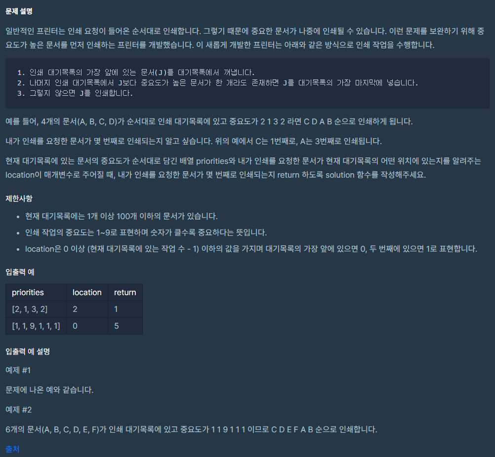

### 프린터 (스택/큐)

* [문제](https://programmers.co.kr/learn/courses/30/lessons/42587)

  

* 문제풀이
    * priorities 배열이 주어졌을때, location 번째에 해당하는 배열은 몇번째에 출력되는지 구하는 문제이다.
    * 처음 주어진 priorities 배열에서 맨 앞의 숫자가 가장 큰 것이 아니라면 그 숫자를 맨 뒤로 보낸다. 나는 여기에서 큐를 써야겠다는 힌트를 얻었다. 배열을 모두 큐에 넣고 다음의 절차를 큐가 빌 때까지 반복한다.
        1. 맨 앞 숫자보다 큰 수 찾기.
        2. 없으면 poll, 있으면 poll & offer.
    * 배열의 인덱스를 따로 저장할 필요가 있기 때문에 Printer 라는 클래스를 만들고 그 객체를 큐에 담았다.
    

* 코드
    ```
    import java.util.*;
    
    class Solution {
        public int solution(int[] priorities, int location) {
            int answer = 0;
            Queue<Printer> q = new LinkedList<>()
            
            for (int i = 0; i < priorities.length; i++) { // print큐에 인덱스번호, 우선순위 삽입
                q.offer(new Printer(i, priorities[i]));
            }
            
            while (!q.isEmpty()) {
                boolean flag = false;
                int com = q.peek().prior;
                
                for (Printer p : q) {
                    if (com < p.prior) { // 맨앞의 수보다 큰 숫자가 존재하면
                        flag = true;
                    }
                }

                if (flag) {
                    q.offer(q.poll());
                } else {// 현재 맨앞의 숫자가 가장 클 때
                    if (q.poll().location == location) {
                        answer = priorities.length - q.size();
                    }
                }
            }
            
            return answer;
        }
    
        class Printer {
            int location;
            int prior;

            Printer(int location, int prior) {
                this.location = location;
                this.prior = prior;
            }
        }
    }
  
    ```
  
* 출처
    *   [[프로그래머스] 프린터 (java)](https://velog.io/@qweadzs/%ED%94%84%EB%A1%9C%EA%B7%B8%EB%9E%98%EB%A8%B8%EC%8A%A4-%ED%94%84%EB%A6%B0%ED%84%B0-java)

