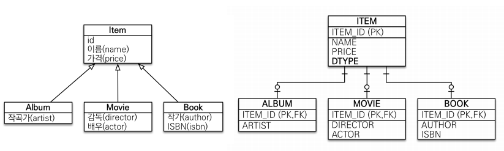
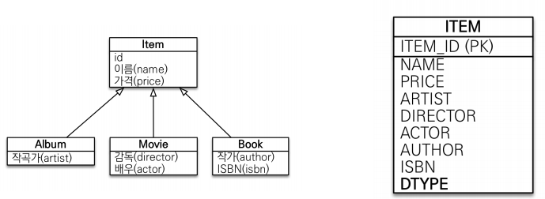
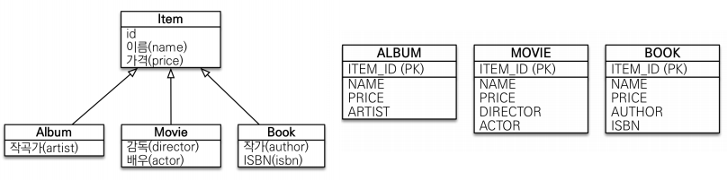

## 상속 관계 매핑

* ### 상속 관계 매핑이란?
    * 관계형 데이터베이스는 상속 관계X
    * 슈퍼타입 서브 타입 관계라는 모델링 기법이 갱체 상속과 유사
    * 객체의 상속과 구조와 DB의 슈퍼타입 서브타입 관계를 매핑
    

* ### 상속 관계 매핑의 종류
    * 각각 테이블로 변환 -> 조인 전략
    * 통합 테이블로 변환 -> 단일 테이블 전략
    * 서브타입 테이블로 변환 -> 구현 클래스마다 테이블 전략
    

* ### 주요 어노테이션
    * @Inheritance(strategy=InheritanceType.XXX)
        * JOINED : 조인 전략
        * SINGLE_TABLE : 단일 테이블 전략
        * TABLE_PER_CLASS : 구현 클래스마다 테이블 전략 - 부모 클래스에서 사용
    * @DiscriminatorColumn(name="DTYPE") - 부모 클래스에서 사용
    * @DiscriminatorValue("XXX") - 자식 클래스에서 사용
    

* ### 조인 전략
    
    * 부모 클래스와 자식 클래스를 생성하는 기법
    * 장점
        * 테이블 정규화
        * 외래 키 참조 무결성 제약조건 활용가능
        * 저장공간 효율화
    * 단점
        * 조회시 조인을 많이 사용, 성능 저하
        * 조회 쿼리가 복잡함
        * 데이터 저장시 INSERT SQL 2번 호출
  
  
* ### 단일 테이블 전략
    
    * 하나의 클래스에 다 때려박는 기법
    * 장점
        * 조인이 필요 없으므로 일반적으로 조회 성능이 빠름
        * 조회 쿼리가 단순함
    * 단점
        * 자식 엔티티가 매핑한 컬럼은 모두 null 허용
        * 단일 테이블에 모든 것을 저장하므로 테이블이 커질 수 있다. 상황에 따라 조회 성능이 조인 전략보다 느려질 수 있다.
    

* ### 구현 클래스마다 테이블 전략
    
    * 부모 클래스를 제외하고 자식 클래스만 생성하는 기법
    * 이 전략은 데이터베이스 설계자와 ORM 전문가 둘 다 추천X(잘 사용하지 않음)
    * 장점
        * 서브 타입을 명확하게 구분해서 처리할 때 효과적
        * not null 제약조건 사용 가능
    * 단점
        * 여러 자식 테이블을 함께 조회할 때 성능이 느림(UNION SQL 필요)
        * 자식 테이블을 통합해서 쿼리하기 어려움
    