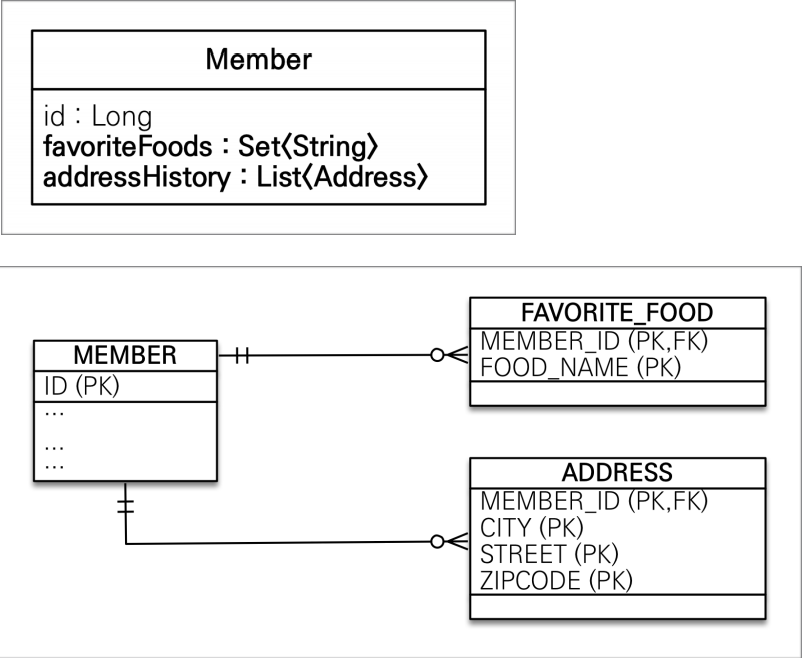

## 값 타입 컬렉션

* ### 값 타입 컬렉션이란?
    
    * 값 타입을 하나 이상 저장할 때 사용
    * @ElementCollection, @CollectionTable 사용
    * 데이터베이스는 컬렉션을 같은 테이블에 저장할 수 없다.
    * 컬렉션을 저장하기 위한 별도의 테이블이 필요함
    * 값 타입 컬렉션은 지연 로딩 전략을 사용한다. (MEMBER 객체 호출 후 FAVORITE_FOOD 는 조회할 때 호출)
    

* ### 값 타입 컬렉션의 제약사항
    * 값 타입은 엔티티와 다르게 식별자 개념이 없다.
    * 값은 변경하면 추적이 어렵다.
    * 값 타입 컬렉션에 변경사항이 발생하면, 주인 엔티티와 연관된 모든 데이터를 삭제하고, 값 타입 컬렉션에 있는 현재 값을 모두 
    다시 저장한다.
    * 값 타입 컬렉션을 매핑하는 테이블은 모든 컬럼을 묶어서 기본 키를 구성해야 함 : null 입력 X, 중복 저장 X
    

* ### 값 타입 컬렉션 대안
    * 실무에서는 상황에 따라 ```값 타입 컬렉션 대신에 일대다 관계를 고려```
    * 일대다 관계를 위한 엔티티를 만들고, 여기에서 값 타입을 사용
    * 영속성 전이(Cascade) + 고아 객체 제거를 사용해서 값 타입 컬렉션 처럼 사용
    

* ### 정리
    * 엔티티 타입의 특징
        * 식별자 O
        * 생명 주기 관리
        * 공유
    * 값 타입의 특징
        * 식별자 X
        * 생명 주기를 엔티티에 의존
        * 공유하지 않는 것이 안전(복사해서 사용)
        * 불변 객체로 만드는 것이 안전
    * 값 타입은 정말 값 타입이라 판단될 때만 사용
    * 엔티티와 값 타입을 혼동해서 엔티티를 값 타입으로 만들면 안됨
    * 식별자가 필요하고, 지속해서 값을 추적, 변경해야 한다면 그것은 값 타입이 아닌 엔티티      

