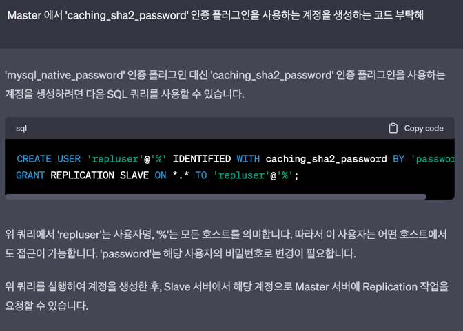

## Docker 사용하여 Mysql 이중화 구현

* ### 출처
  * [Docker를 이용하여 MySQL Replication 구성해보기]('https://jupiny.com/2017/11/07/docker-mysql-replicaiton')
    * 주의: Master 서버에서 User 생성 시에 패스워드 암호화 방식을 조심해야 함.
      * 
      * ```sql
          CREATE USER 'repluser'@'%' IDENTIFIED WITH caching_sha2_password BY 'password';
          GRANT REPLICATION SLAVE ON *.* TO 'repluser'@'%';
        ``` 