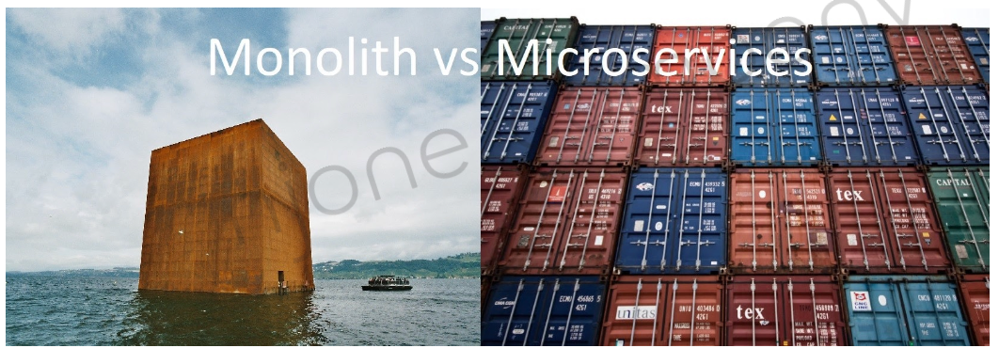
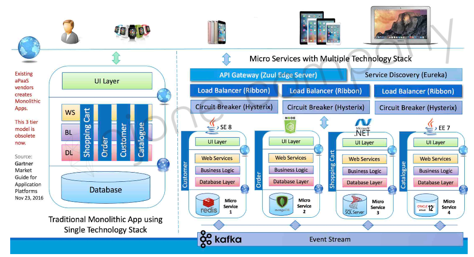
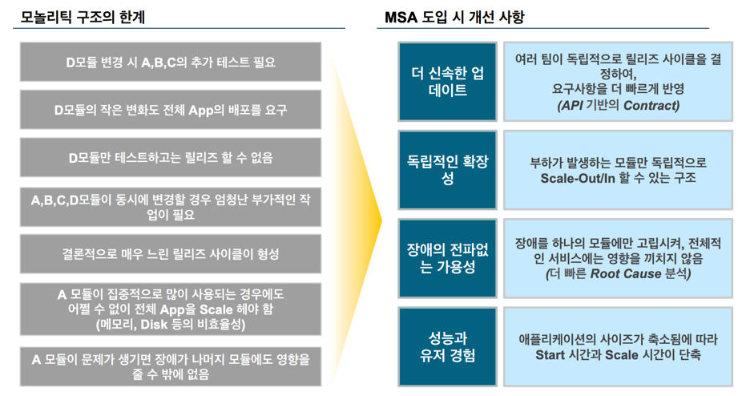
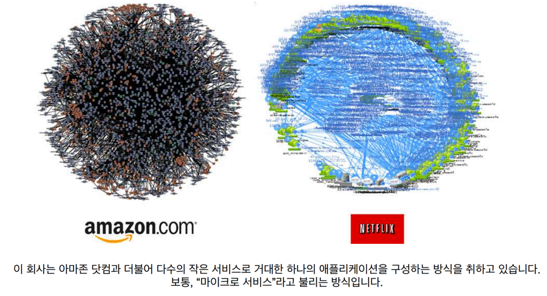
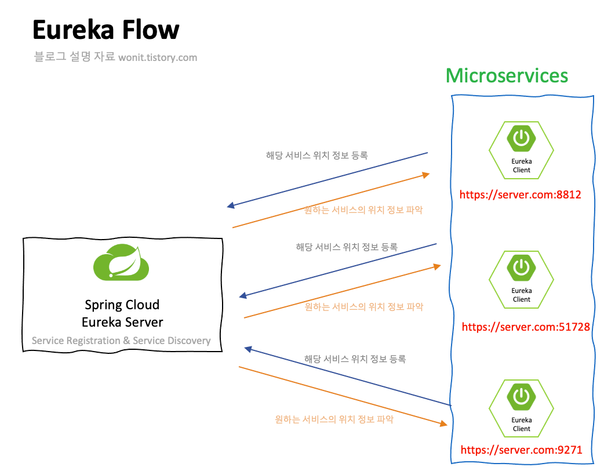
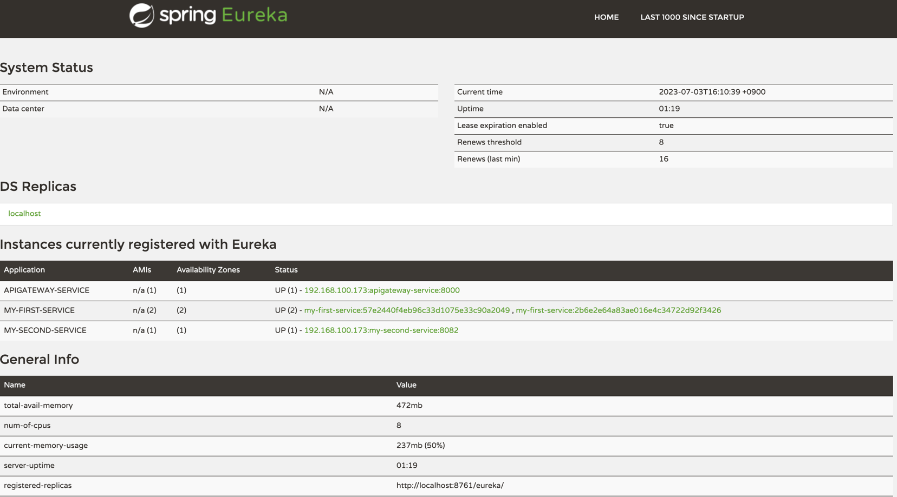
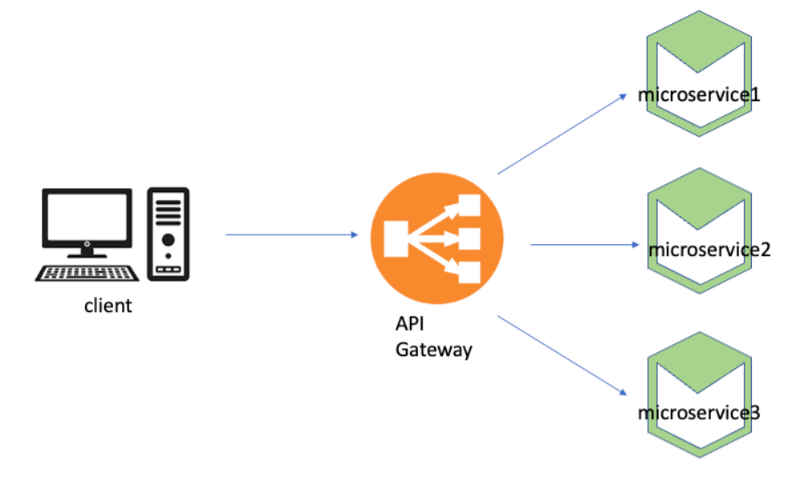
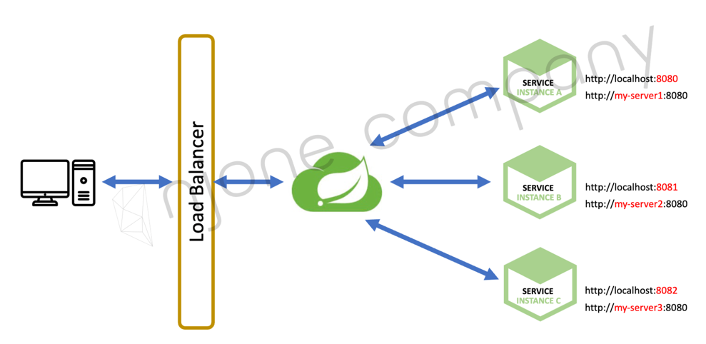
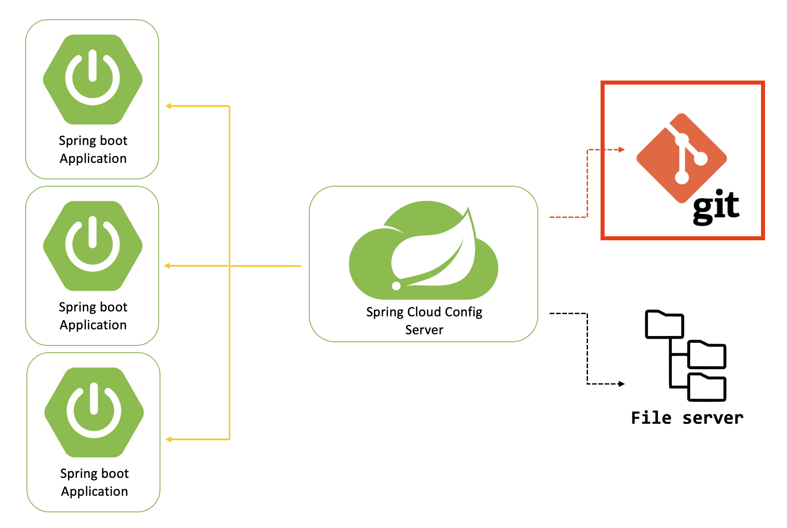
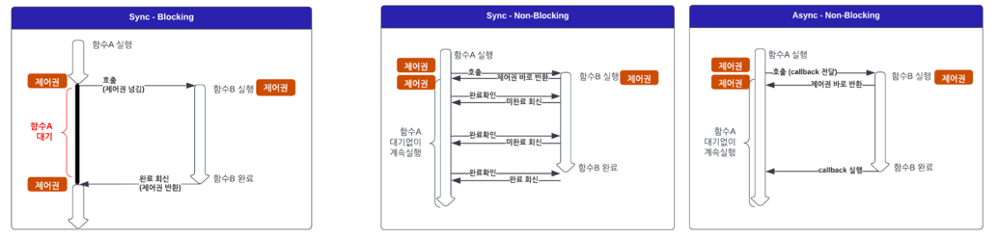

# Spring MicroService Architecture
## MSA 란?
* 각각을 마이크로하게 나눈 독립적인 서비스를 연결한 구조

### 모놀로틱 구조와 MSA




### 모놀로틱 구조의 한계


### 모놀로틱 구조와 MSA 의 비교


### MSA 의 단점
* 성능 - 서비스 간 호출 시 API를 사용하기 때문에, 통신 비용이나, Latency가 그만큼 늘어나게 됩니다.
* 테스트 / 트랜잭션 - 서비스가 분리되어 있기 때문에 테스트와 트랜잭션의 복잡도가 증가하고, 많은 자원을 필요로 합니다.
* 데이터 관리 - 데이터가 여러 서비스에 걸쳐 분산되기 때문에 한번에 조회하기 어렵고, 데이터의 정합성 또한 관리하기 어렵습니다.
* 마이크로서비스에 대한 내부 경험부족
* 여러 번의 배포 (CI/CD 를 이용하여 해결)

### MSA 의 장점
* 배포(deployment) 관점
    * 서비스 별 개별 배포 가능 ( 배포 시 전체 서비스의 중단이 없음)
        * 요구사항을 신속하게 반영하여 빠르게 배포할 수 있음.
* 확장(scaling) 관점
    * 특정 서비스에 대한 확장성이 용이함.
        * 클라우드 사용에 적합한 아키텍쳐.
* 장애(failure) 관점
    * 장애가 전체 서비스로 확장될 가능성이 적음
        * 부분적 장애에 대한 격리가 수월함

### 아마존과 넷플릭스


## Spring MSA
### Spring Cloud Netflix Eureka


* 각각의 서비스 인스턴스들이 동적으로 확장, 축소 되더라도 인스턴스의 상태를 하나의 서비스로 관리할 수 있는 서비스
* Service Discovery
    * 각각의 서비스의 위치가 등록된 서버에서 특정 작업을 위한 서버의 위치를 파악하는 작업을 뜻한다.
      우리는 Service Discovery를 위해서 *Spring Cloud Netflix - Eureka Server*를 사용한다.
* Service Registry
    * 각각의 서비스가 자신의 위치(IP) 정보를 특정 서버에 등록 *Registry* 하는 작업을 말한다.
      우리는 Service Registry를 위해서 *Spring Cloud Netflix - Eureka Client*를 사용한다.


### Spring Cloud Gateway



* 단일 진입점 역할을 수행하며, 모든 API 요청을 받아 해당 요청을 처리할 적절한 마이크로서비스로 라우팅.
* 보안, 인증, 로드밸런싱, 필터링, 변환 등의 기능을 제공하여 클라이언트와 마이크로서비스 간의 인터페이스를 관리하고, 부하 분산과 안전한 통신을 지원

### Spring Cloud Config

* 분산 시스템에서 외부화된 설정 정보를 서버 및 클라이언트에게 제공하는 시스템.
* 외부에서 모든 환경에 대한 정보들을 관리해주는 중앙 서버.
* 기본적으로 설정 정보 저장을 위해 git을 사용하도록 되어있어서 손쉽게 외부 도구들로 접근 가능하고, 버전 관리도 가능

### MSA 내 API 통신
* RestTemplate
  * Spring 3.0 부터 지원 
  * RESTful 형식을 지원 
  * 멀티 스레드 방식 
  * Blocking I/O 기반의 동기 방식 API 
  * Spring 4.0에서 비동기 문제를 해결하고자 AsyncRestTemplate 이 등장했으나, 현재 deprecated 됨
    ``` java
        /* Using as rest template */
        String orderUrl = String.format("http://localhost:8080/user", userId);
        ResponseEntity<List<ResponseOrder>> orderListResponse =
                restTemplate.exchange(orderUrl, HttpMethod.GET, null,
                        new ParameterizedTypeReference<List<ResponseOrder>>() {
                });

        List<ResponseOrder> ordersList = orderListResponse.getBody();
    ```
* WebClient
  * Spring 5.0 부터 지원 
  * 싱글 스레드 방식 
  * Non-Blocking 방식, 동기/비동기 모두 지원 
  * Reactor 기반의 Functional API (Mono, Flux)
  
    ``` java
        WebClient webClient = WebClient.create("https://api.example.com");

        Mono<String> responseMono = webClient.get()
                .uri("/users/{id}", 123)
                .accept(MediaType.APPLICATION_JSON)
                .retrieve()
                .bodyToMono(String.class);

        responseMono.subscribe(response -> {
            System.out.println("Response: " + response);
        });
    ```
* Kafka
  * 분산 메시징 시스템으로, 이벤트 기반 아키텍처에서 비동기적인 메시지 전달을 지원. 
  * 마이크로서비스 간에 이벤트를 안전하고 신뢰성 있게 전달할 수 있다. 
  * 서비스는 Kafka의 토픽에 이벤트를 발행하거나 구독하여 필요한 이벤트를 수신하고 처리할 수 있다.

### Non-Blocking 방식의 데이터 타입
* Mono
  * Mono 는 0 또는 1개의 요소를 포함하는 리액티브 타입. 
  * Mono 는 단일 결과를 반환하거나 오류를 전파할 수 있다. 
  * 예를 들어, 단일 객체의 조회, 생성, 수정 또는 삭제와 같은 단일 동작을 처리할 때 주로 사용된다.
* Flux
  * Flux 는 0개 이상의 요소를 포함하는 리액티브 타입. 
  * Flux 는 여러 개의 결과를 스트림으로 반환하거나, 오류 또는 완료 신호를 전파할 수 있다. 
  * 예를 들어, 데이터베이스의 모든 레코드를 조회하거나, 외부 API 로부터 여러 개의 데이터를 가져올 때 주로 사용된다.
