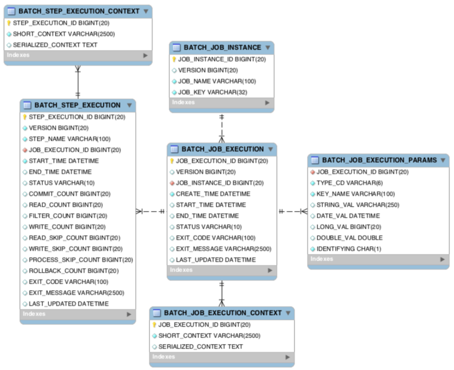
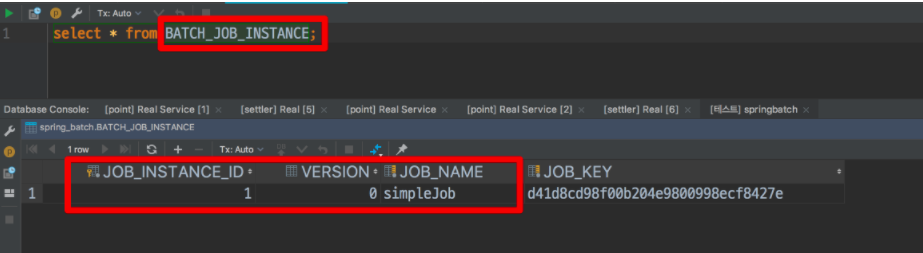
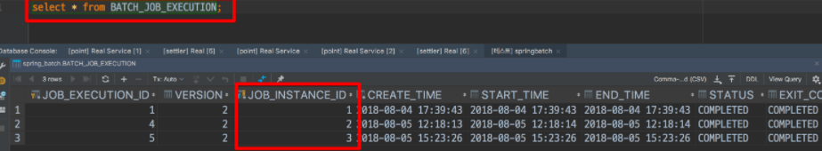
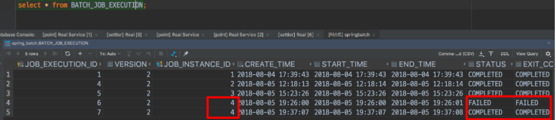
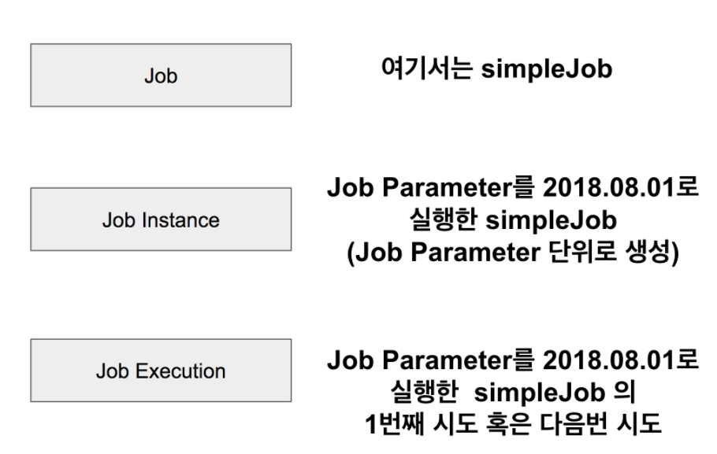

### Spring Batch의 메타 데이터
* ```Spring Batch```는 어플리케이션 코드만 작성하면 되는 것이 아니라, 메타 데이터 테이블들이 필요하다.
* ```메타 데이터```
    * 데이터를 설명하는 데이터
* ```Spring Batch```의 메타 데이터
    * 이전에 실행한 ```Job```이 어떤 것들이 있는지
    * 최근 실패한 ```Batch Parameter```가 어떤 것들이 있고, 성공한 ```Job```은 어떤 것들이 있는지
    * 다시 실행한다면 어디서 부터 시작하면 될지
    * 어떤 ```Job```에 어떤 ```Step```들이 있었고, ```Step```들 중 성공한 ```Step```과 실패한 ```Step```들은 어떤 것들이 있는지
    * 등등 ```Batch``` 어플리케이션을 운영하기 위한 메타 데이터가 여러 테이블에 나눠져 있다.
    
      

### BATCH_JOB_INSTANCE
* 테이블 구조
    
  
* ```BATCH_JOB_INSTANCE``` 테이블은 ```Job Parameter```에 따라 생성되는 테이블이다.
* 이때, ``` Job Parameter```는 ```Spring Batch```가 실행될 때 외부에서 받을 수 있는 파라미터이다.
* 예시) 
  * 특정 날짜를 ```Job Parameter```로 넘기면 ```Spring Batch```에서는 해당 날짜 데이터로 조회/가공/입력 등의 작업을 할 수 있다.
  * 같은 ```Batch Job```이라도 ```Job Parameter```가 다르면 ```BATCH_JOB_INSTANCE```에는 기록되며, ```Job_Parameter```가 같다면
  기록되지 않는다.
* 즉, 동일한 ```Job```이 ```Job Parameter```가 달라지면 그때마다 ```BATCH_JOB_INSTANCE```에 생성되며, 동일한 ```Job Parameter```는 여러개 존재할 수 없다.


### BATCH_JOB_EXECUTION
* 테이블 구조
  

* ```JOB_EXECTUION```과 ```JOB_INSTANCE```는 부모-자식 관계이다. 
* ```JOB_EXECTUION```은 자신의 부모 ```JOB_INSTACNE```가 성공/실패했던 모든 내역을 갖고 있다 .
* 예시)
  
  * ```Job Parameter```가 ```requestDate=20180807```로 생성된 ```BATCH_JOB_INSTACNE (id=4)``` 가 2번 실행되었고, 첫번째는 실패, 두번째는 성공했다는 것을 알 수 있다.
  * 여기서 재밌는 것은 동일한 ```Job Parameter```로 2번 실행했는데 같은 파라미터로 실행되었다는 에러가 발생하지 않았다는 점이다.
  * 중요! ```Spring Batch```는 동일한 ```Job Parameter```로 성공한 기록이 있을때만 재수행이 안된다는 것이다. 
  

### JOB, JOB_INSTANCE, JOB_EXECUTION
* 정리
  
  

### 참고
[3. Spring Batch 가이드 - 메타테이블엿보기](https://jojoldu.tistory.com/326?category=902551)