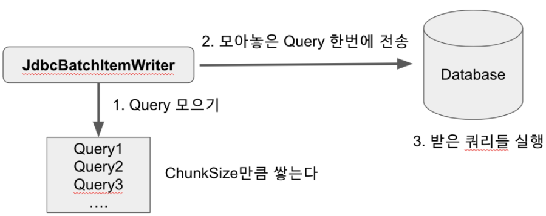
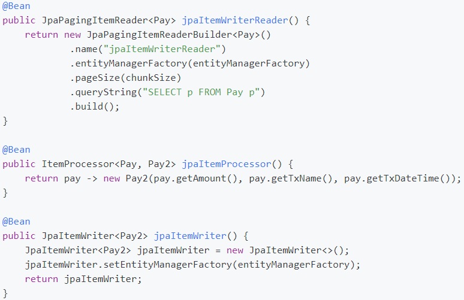

### ItemWriter 소개
* `ItemWriter`는 `Spring Batch`에서 사용하는 출력 기능이다.
* `ItemWriter`는 `item`하나를 작성하지 않고 `Chunk`단위로 묶인 `item List`를 다룬다.
    * 이 때문에 `ItemWriter`인터페이스와 `ItemReader`인터페이스는 조금 다르다.
    * `Reader`의 `read()`는 `Item` 하나를 반환하는 반면, `Writer`의 `write()`는 인자로 `Item List`를 받는다.
* `Reader`와 `Processor`를 거쳐 처리된 `Item`을 `Chunk`단위 만큼 쌓은 뒤`(item List)`  이를 `Writer`에게 전달하는 것이다.


### Database Writer
* `Writer`는 `Chunk`단위의 마지막 단계이기 때문에, `Database`의 영속성과 관련해서는 항상 마지막에 `Flush`를 해줘야만 한다.
    * 예를 들어 아래와 같이 영속성을 사용하는 `JPA, Hibernate`의 경우 `ItemWriter` 구현체에서는 `flush()`와 `session.clear()`가 따라옵니다.
* `Writer`가 받은 모든 `Item`이 처리 된 후, `Spring Batch`는 현재 트랜잭션을 커밋한다.
* 데이터베이스와 관련된 `Writer`
    * `JdbcBatchItemWriter`
    * `HibernateItemWriter`
    * `JpaItemWriter`
    

### JdbcBatchItemWriter
* `ORM`을 사용하지 않는 경우 대부분의 `Writer`는 `JdbcBatchItemWriter`를 사용한다.
* `JDBC`의 `Batch` 기능을 사용하여 한 번에 `Database`로 전달하여 `Database`내부에서 쿼리들이 실행되도록 한다.
  
  * 이렇게 처리하는 이유는 어플리케이션과 데이터베이스 간에 데이터를 주고 받는 회수를 최소화하여 성능 향상을 꾀하기 위함이다.
  * 예) 업데이트를 일괄 처리로 그룹화하면 데이터베이스와 어플리케이션간 왕복 횟수가 줄어들어 성능이 향상 된다.
* `JdbcBatchItemWriterBuilder`의 설정 값 `beanMapped`와 `columnMapped` 차이
  * `Reader`에서 `Writer`로 넘겨주는 타입이 `Map<String, Object>`냐, `Pay.class`와 같은 `Pojo` 타입이냐 입니다.
  * `beanMapped 사용` 
      ```
        /**
        * reader에서 넘어온 데이터를 하나씩 출력하는 writer
        */
        @Bean // beanMapped()을 사용할때는 필수
        public JdbcBatchItemWriter<Pay> jdbcBatchItemWriter() {
            return new JdbcBatchItemWriterBuilder<Pay>()
                    .dataSource(dataSource)
                    .sql("insert into pay2(amount, tx_name, tx_date_time) values (:amount, :txName, :txDateTime)")
                    .beanMapped()
                    .build();
        }
     ```
  * `columnMapped  사용`
    ```
    /**
        * reader에서 넘어온 데이터를 하나씩 출력하는 writer
        */
        @Bean // beanMapped()을 사용할때는 필수
        public JdbcBatchItemWriter<Pay> jdbcBatchItemWriter() {
            return new JdbcBatchItemWriterBuilder<Map<String, Object>>() // Map 사용
                    .columnMapped()
                    .dataSource(this.dataSource)
                    .sql("insert into pay2(amount, tx_name, tx_date_time) values (:amount, :txName, :txDateTime)")
                    .build();
        }
    ```
* `sql` 의 `values(:field)` 값은 `Dto`의 `Getter`혹은 `Map`의 `Key`에 매핑되어 값이 할당된다.
* 반환 값 `JdbcBatchItemWriter<>`의 제네릭 타입은 `Reader`에서 넘겨주는 값의 타입이다.
* `afterPropertiesSet ()` 메서드
    * 각각의 `Writer`들이 실행되기 위해 필요한 필수 값들이 제대로 세팅되어 있는 지를 체크한다.
    * `Writer`를 생성하고, 그 아래에서 바로 실행해보면 어느 값이 누락되었는지 명확하게 인지할 수 있어 많이들 사용하는 옵션이다.
    * [사용예시](https://dahye-jeong.gitbook.io/spring/spring/2021-02-15-spring-boot/2020-03-23-batch/2021-02-10-batch-itemwriter)
  

### JpaItemWriter
* `JpaItemWriter`는 `JPA`를 사용하기 때문에 영속성 관리를 위해 `EntityManager`를 할당해주어야 하는데, 일반적으로 `spring-boot-starter-data-jpa`를
    의존성 등록하면 `Entity Manager`가 `Bean`으로 자동생성되어 `DI(생성자 주입)`코드만 주입해주면 된다.
* `JpaItemWriter`는 `JdbcBatchItemWriter`와 달리 넘어온 `Entity`를 데이터베이스에 반영한다.
* 즉, `JpaItemWriter`는 `Entity `클래스를 제네릭 타입으로 받아야만 한다.
* 사용 예시)
  
  * `Processor`를 사용한 이유는 `Reader`에서 읽은 데이터를 가공해야할 때 `Processor`가 필요하기 때문에 사용


### Custom ItemWriter
* `Reader`와 달리 `Writer`의 경우 `Custom`하게 구현해야할 일이 많아서 사용.
* `Spring Batch`에서 공식적으로 지원하지 않는 `Writer`를 사용하고 싶을때 `ItemWriter`인터페이스를 구현
* 사용 예시)
    ```
    @Bean
    public ItemWriter<Pay2> customItemWriter() {
        return new ItemWriter<Pay2>() {
            @Override
            public void write(List<? extends Pay2> items) throws Exception {
                for (Pay2 item : items) {
                    System.out.println(item);
                }
            }
        };
    }
    ``` 
  

### 주의 사항
* `ItemWriter`를 사용할 때 `Processor`에서 `Writer`에 `List`를 전달하고 싶을 때
  * [Writer에 List형 Item을 전달하고 싶을때](https://jojoldu.tistory.com/140)
  

### 참고
* [8. Spring Batch 가이드 - ItemWriter](https://jojoldu.tistory.com/339?category=902551)