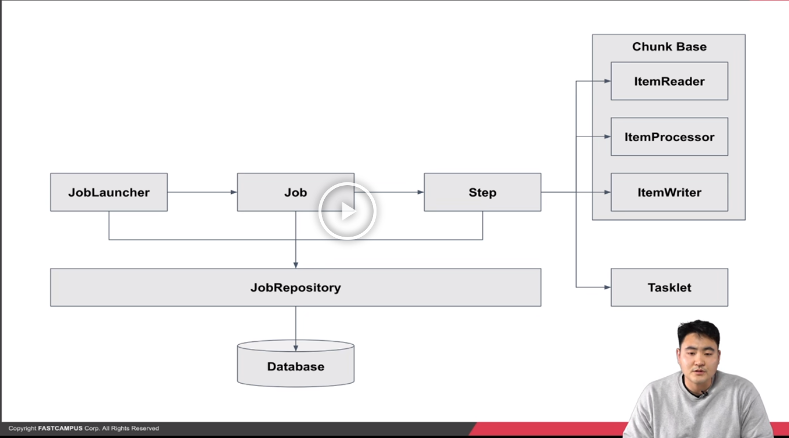
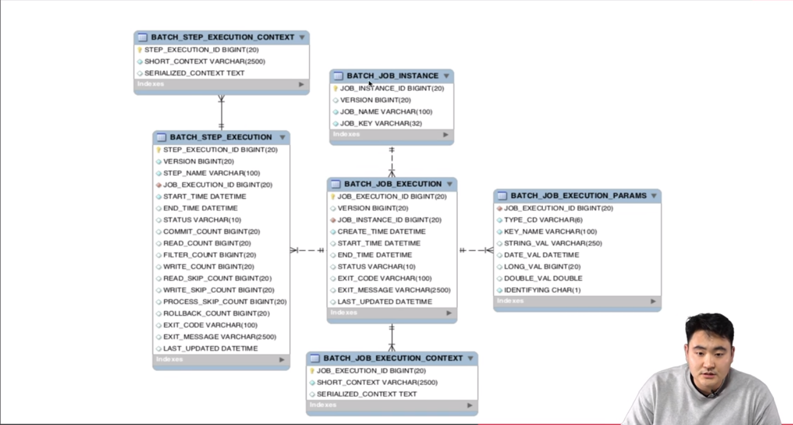
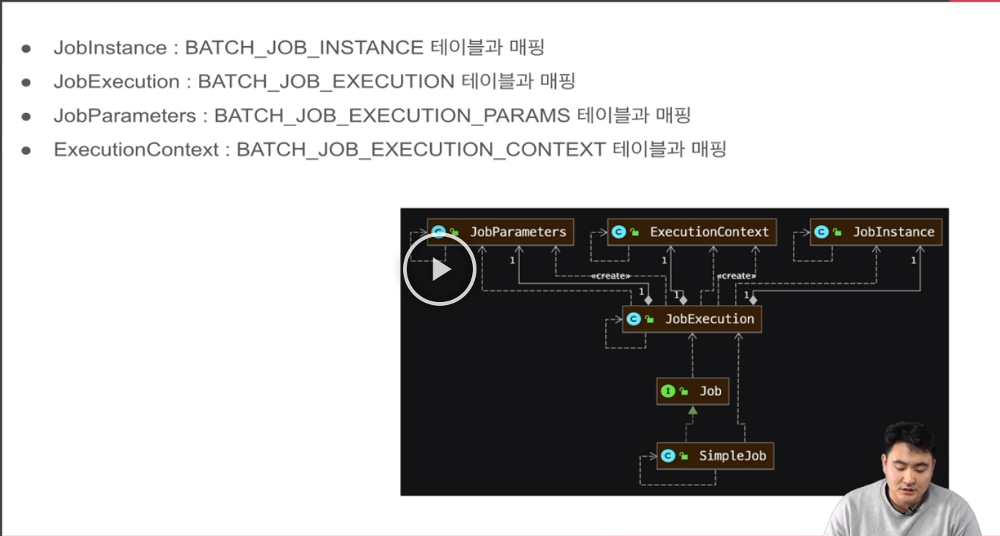
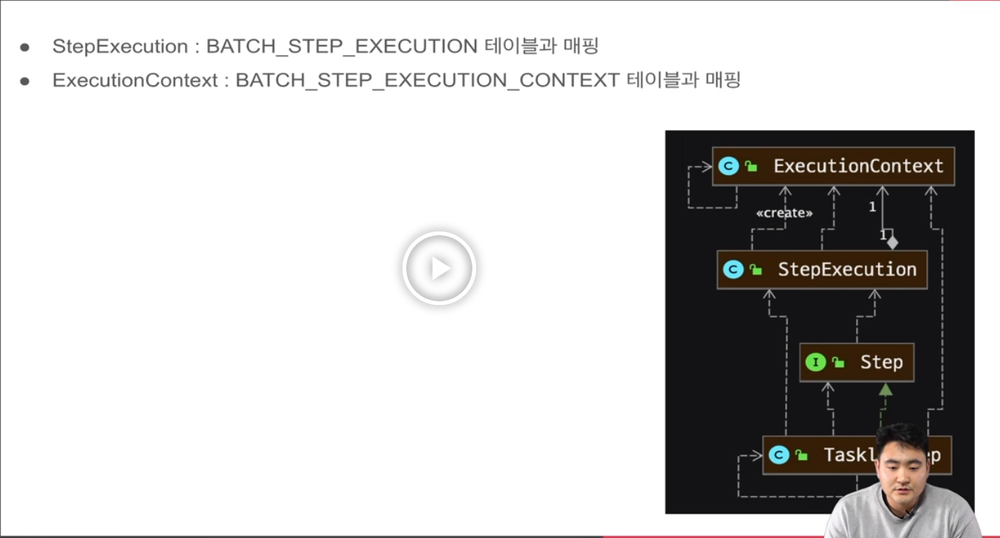

## 스프링 배치 아키텍쳐

### 스프링 배치 기본구조


* Job 타입의 bean 이 생성이 되면 JobLauncher 에 의해 Job 이 실행되고, Job 은 Step 을 실행한다.
* JobRepository 는 DB 또는 메모리에 스프링 배치가 실행할 수 있도록 배치의 메타 데이터를 관리하는 것.
    * 스프링 배치의 전반적인 데이터를 관리하는 클래스


* Job 은 JobLauncher 에 의해 실행
* Job 은 배치의 실행 단위를 의미
* Job 은 N 개의 Step 을 실행할 수 있으며, 흐름(Flow) 을 관리할 수 있다.
    * 예를 들면, A Step 실행 후 조건에 따라 B Step 또는 C Step 을 실행 설정 (A, B , C Step 모두 실행도 가능)


### 스프링 배치 기본 구조 - Step

* Step 은 Job 의 세부 실행 단위이며, N개가 등록되어 실행된다.
* Step 의 실행 단위는 크게 2가지로 나눌 수 있다.
    1. Chunk 기반 : 하나의 큰 덩어리를 n 개씩 나눠서 실행
    2. Task 기반 : 하나의 작업 기반으로 실행
    * 물론 Task 를 쪼개서 Chunk 처럼 사용할 수 있지만, 사용 방법에따라 나누어 둔 것.
* Chunk 기반 Step 은 ItemReader, ItemProcessor, ItemWriter 가 있다.
    * 여기서 Item 은 배치 처리 대상 객체를 의미한다.
* ItemReader 는 배치 처리 대상 객체를 읽어 ItemProcessor 또는 ItemWriter 에게 전달한다.
    * 예를 들면, 파일 또는 DB 에서 데이터를 읽는다.
* ItemProcessor 는 input 객체를 output 객체로 filtering 또는 processing 해 ItemWriter 에게 전달한다.
    * 예를 들면, ItemReader 에서 읽은 데이터를 수정 또는 ItemWriter 대상 인지 filtering 한다.
    * ItemProcessor 는 Optional 하다.
    * ItemProcessor 가 하는 일을 ItemReader 또는 Writer 가 그 기능을 대신 할 수 있음.
* ItemWriter 는 배치 처리 대상 객체를 처리한다.
    * 예를 들면, DB update 를 하거나, 처리 대상 사용자에게 알림을 보낸다.
    * 제일 마지막에 실행 되기 때문에 정산을 해서 insert 하거나 하는 등에 사용된다.


### 스프링 배치 테이블 구조와 이해


* 스프링 배치 실행과 결과를 저장하기 위한 메타 데이터가 저장되는 테이블 (메타 테이블)
* BATCH_JOB_INSTANCE
  * Job 이 실행되며 생성되는 최상위 계층의 테이블
  * job_name 과 job_key 를 기준으로 하나의 row 가 생성되며, 같은 job_name 과 job_key 가 저장될 수 없다.
  * job_key 는 BATCH_JOB_EXECUTION_PARAMS 에 저장되는 Parameter 를 나열해 암호화해 저장한다.
* BATCH_JOB_EXECUTION
  * Job 이 실행되는 동안 시작/종료 시간, job 상태 등을 관리
* BATCH_JOB_EXECUTION_PARAMS
  * Job 을 실행하기 위해 주입된 parameter 정보 저장
* BATCH_JOB_EXECUTION_CONTEXT
  * Job 이 실행되며 공유해야할 데이터를 직렬화해 저장
* BATCH_STEP_EXECUTION
  * Step 이 실행되는 동안 필요한 데이터 또는 실행된 결과 저장
* BATCH_STEP_EXECUTION_CONTEXT
  * Step 이 실행되며 공유해야할 데이터를 직렬화해 저장
  

* Spring-batch-core 밑에 테이블 생성 sql 이 있음.


* ```application.yml``` 또는 ```application.properties``` 에서 스크립트의 생성 시점을 정할 수 있음.
  * ```initialize-schema``` 를 사용하면 됨.
    * always : 항상 생성 (개발시에만 사용. 운영에서는 사용x 직접 스크립트를 생성해서 관리 해야한다.)
    * embedded : h2 같은 내장 DB 에만 사용.
    * never : 항상 생성 하지않음. (운영에 사용.)
  

### Job , JobInstance , JobExecution , Step , StepExecution 이해



* ```JobInstance``` 의 생성 기준은 ```JobParameters``` 중복 여부에 따라 생성
* 다른 ```parameter``` 로 ```Job``` 이 실행되면, ```JobInstance``` 가 생성
* 같은 ```parameter``` 로 ```Job``` 이 실행되면, 이미 생성된 ```JobInstance``` 가 실행
* ```JobExecution``` 은 항상 새롭게 생성 (재실행 여부에 상관없이)
  * 예를 들어
    * 처음 ```Job``` 실행 시 ```date parameter``` 가 1월 1일로 실행 됐다면, 1번 ```JobInstance``` 생성
    * 다음 ```Job``` 실행 시 ```date parameter``` 가 1월 2일로 실행 됐다면, 2번 ```JobInstance``` 생성
    * 다음 ```Job``` 실행 시 ```date parameter``` 가 1월 2일로 실행 됐다면, 2번 ```JobInstance``` 재실행
      * 이때 ```Job``` 이 재실행 대상이 아닌 경우 에러가 발생
* ```Job``` 을 항상 새로운 ```JobInstance``` 가 실행 될 수 있도록 ```RunIdIncrementer``` 제공
  * ```RunIdIncrementer``` 는 항상 다른 run.id 를 ```Parameter``` 로 설정
  
  
* 마무리 
  * 첫째 : ```JobInstance``` 의 생성 기준 ```job_name``` 과 ```job_key``` 를 기준으로 ```JobInstance``` 생성 또는 재실행 , 재실행 실패가 결정
    * 하나의 ```Job``` 은 같은 ```parameter``` 로 실행이 불가능 
  * 둘째 : ```ExecutionContext``` 라는 객체는 ```Job``` 과 ```Step``` 의 ```context```를 관리하는 객체
    * 이 객체를 통해 데이터를 서로 공유할 수 있다.
  


### 데이터 공유 ExecutionContext 이해

* ```Job``` 내에서 공유할 수 있는 ```BATCH_JOB_EXECUTION_CONTEXT```
* 하나의 ```Step``` 에서 공유할 수 있는 ```BATCH_STEP_EXECUTION_CONTEXT```
* 접근 방식
  ```
  @Bean
    public Step shareStep1() {
        return stepBuilderFactory.get("shareStep1")
                .tasklet((contribution, chunkContext) -> {
                    // step ExecutionContext.put
                    StepExecution stepExecution = contribution.getStepExecution();
                    ExecutionContext stepExecutionContext = stepExecution.getExecutionContext();
                    stepExecutionContext.putString("step", "step execution context");

                    // job ExecutionContext.put
                    JobExecution jobExecution = stepExecution.getJobExecution();
                    ExecutionContext jobExecutionContext = jobExecution.getExecutionContext();
                    jobExecutionContext.putString("job", "job execution context");

                    // log
                    JobInstance jobInstance = jobExecution.getJobInstance();
                    JobParameters jobParameters = jobExecution.getJobParameters();

                    log.info("jobName : {}, stepName : {}, run.id : {}",
                            jobInstance.getJobName(),
                            stepExecution.getStepName(),
                            jobParameters.getLong("run.id"));

                    return RepeatStatus.FINISHED;
                }).build();
    }

    @Bean
    public Step shareStep2() {
        return stepBuilderFactory.get("shareStep2")
                .tasklet((contribution, chunkContext) -> {
                    // step ExecutionContext.get
                    StepExecution stepExecution = contribution.getStepExecution();
                    ExecutionContext stepExecutionContext = stepExecution.getExecutionContext();

                    // job ExecutionContext.get
                    JobExecution jobExecution = stepExecution.getJobExecution();
                    ExecutionContext jobExecutionContext = jobExecution.getExecutionContext();

                    // log
                    log.info("jobValue : {}, stepValue : {}",
                            jobExecutionContext.getString("job", "emptyJob"),
                            stepExecutionContext.getString("step", "emptyStep"));

                    return RepeatStatus.FINISHED;

                }).build();
    }
  ```