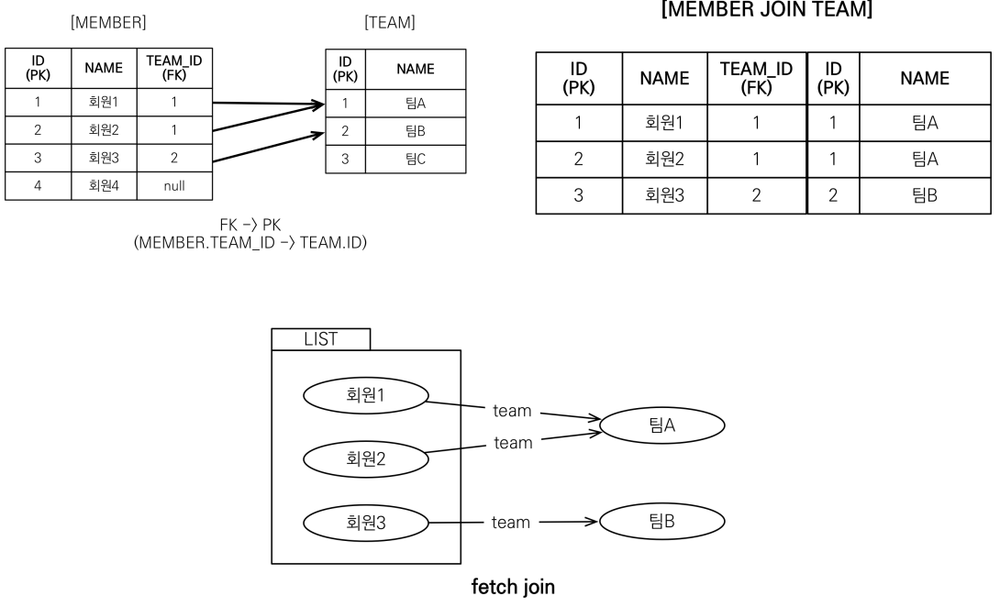
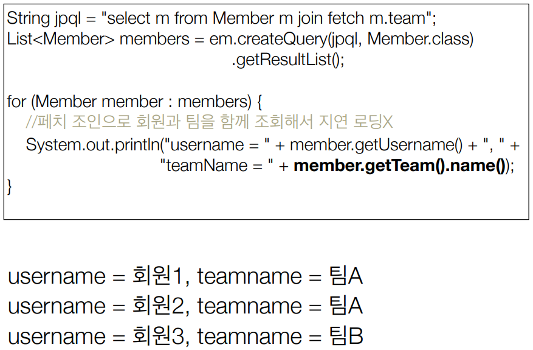
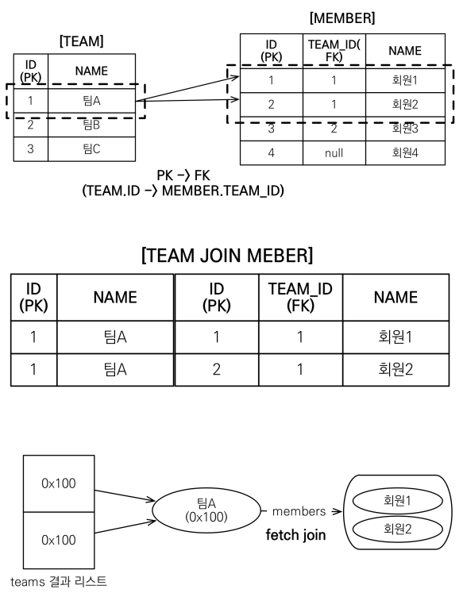

## 페치 조인(fetch join)

* ### 페치 조인이란?
    * SQL 조인 종류 ❌
    * JPQL 에서 `성능 최적화`를 위해 제공하는 기능
    * 연관된 엔티티나 컬렉션을 `SQL 한 번에 함께 조회`하는 기능
    * join fetch 명령어 사용
    * 페치 조인 ::= `[LEFT [OUTER] | INNER] JOIN FETCH 조인 경로`
    

* ### 엔티티 페치 조인
    * 회원을 조회하면서 연관된 팀도 함께 조회(SQL 한 번에)
    * SQL 을 보면 회원 뿐만 아니라 `팀(T.*)`도 함께 `SELECT`
    * `[JPQL]`
        * `select m from Member m join fetch m.team`
    * `[SQL]`
        * `SELECT M.*, T.* FROM MEMBER M INNER JOIN TEAM T ON M.TEAM_ID = T.ID`
    * ### 환경 예시
        
    * ### 페치 조인 사용 코드      
        
      

* ### 컬렉션 페치 조인
    * 일대다 관계, 컬렉션 페치 조인
    * `[JPQL]`
        * `select t from Team t join fetch t.members`
    * `[SQL]`
        * `select T.*, M.* FROM TEAM T INNER JOIN MEMBER M ON T.ID = M.TEAM_ID`
    * ### 환경 예시
        
    * ### 컬렉션 페치 조인 사용 코드
        
      

* ### 페치 조인과 DISTINCT 
    * SQL 의 DISTINCT 는 중복된 결과를 제거하는 명령
    * JPQL 의 DISTINCT 는 2가지 기능 제공
        * SQL 에 DISTINCT 를 추가
        * 애플리케이션에서 엔티티 중복 제거
    

* ### 페치 조인과 일반 조인의 차이
    * 일반 조인 실행시 연관된 엔티티를 함께 조회하지 않음
    * JPQL 은 결과를 반환할 때 연관관계 고려 ❌
    * 단지 SELECT 절에 지정한 엔티티만 조회할 뿐
    * 여기서는 팀 엔티티만 조회하고, 회원 엔티티는 조회 ❌
    * 페치 조인을 사용할 때만 연관된 엔티티도 함께 `조회(즉시 로딩)`
    * `페치 조인은 객체 그래프를 SQL 한 번에 조회하는 개념`
    

* ### 페치 조인 실행 예시
    * 페치 조인은 연관된 엔티티를 함께 조회함
    * `[JPQL]`
        * `select t from Team t join fetch t.members`
    * `[SQL]`
        * `SELECT T.*, M.* FROM TEAM T INNER JOIN MEMBER M ON T.ID = M.TEAM_ID`
    

* ### 페치 조인의 특징과 한계
    * `N + 1 문제 해결 가능`⭕
    * `페치 조인 대상에는 별칭을 줄 수 없다.`
        * 예시) `select t From Team t join fetch t.member as m` ❌
        * 하이버네이트는 가능, 가급적 사용 ❌
    * `둘 이상의 컬렉션은 페치 조인 할 수 없다.` 
    * `컬렉션을 페치 조인하면 페이징 API(setFirstResult, setMaxResults)를 사용할 수 없다.`
        * 일대일, 다대일 같은 단일 값 연관 필드들은 페치 조인해도 페이징 가능
        * 하이버네이트는 경고 로그를 남기고 메모리에서 페이징(매우 위험)
        * 페치 조인을 사용하지 않으면 가능하다.
            ```
            List<Team> result = em.createQuery("select t from Team t", Team.class)
                    .setMaxResults(0)
                    .setMaxResults(2)
                    .getResultList();

            for (Team team : result) {
                System.out.println("teamname = " + team.getName() + ", team = " + team);
                for (Member member : team.getMembers()) {
                    //페치 조인으로 팀과 회원을 함께 조회해서 지연 로딩 발생 안함
                    System.out.println("-> username = " + member.getUsername()+ ", member = " + member);
                }
            }
            ```
            * 단! 지연 로딩때문에 N + 1 문제가 생길 수 있으니, `@BatchSize(size = 100)`를 사용해야 한다.
                ```
                @BatchSize(size = 100)
                @OneToMany(mappedBy = "team")
                private List<Member> members = new ArrayList<>();  
                ```            
            * size 는 보통 1000 이하를 사용
            * ✅ 전역으로 설정할 수도 있다. (보통 사용 ⭕)
                * 설정 파일에 `<property name="hibernate.default_batch_fetch_size" value="100"/>` 추가
    * 연관된 엔티티들을 SQL 한 번으로 조회 - 성능 최적화
    * 엔티티에 직접 적용하는 글로벙 로딩 전략보다 우선함
        * @OneToMany(fetch = FetchType.LAZY) // 글로벌 로딩 전략
    * 실무에서 글로벌 로딩 전략은 모두 지연 로딩
    * 최적화가 필요한 곳은 페치 조인 적용
    

* ### 페치 조인 - 정리
    * 모든 것을 페치 조인으로 해결할 수는 없음
    * 페치 조인은 객체 그래프를 유지할 때 사용하면 효과적
    * 여러 테이블을 조인해서 엔티티가 가진 모양이 아닌 전혀 다른 결과를 내야 하면, 페치 조인보다는
    일반 조인을 사용하고 필요한 데이터들만 조회해서 DTO 로 반환하는 것이 효과적