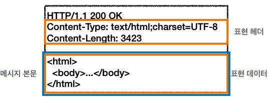

## HTTP 헤더1 - 일반헤더

### 용도
* HTTP 전송에 필요한 모든 부가정보
* 예) 메시지 바디의 내용, 메시지 바디의 크기, 압축, 인증, 요청 클라이언트, 서버 정보, 캐시 관리 정보

### HTTP BODY (MESSAGE BODY - RFC7230(최신))

* 메시지 본문(message body)을 통해 표현 데이터 전달 
* 메시지 본문 = 페이로드(payload) 
* **표현**은 요청이나 응답에서 전달할 실제 데이터 
* **표현 헤더는 표현 데이터**를 해석할 수 있는 정보 제공 
  * 데이터 유형(html, json), 데이터 길이, 압축 정보 등등 
* 참고: 표현 헤더는 표현 메타데이터와, 페이로드 메시지를 구분해야 하지만, 여기서는 생략

### 표현
* Content-Type
  * 표현 데이터의 형식 설명
  * 미디어 타입, 문자 인코딩
* Content-Encoding
  * 표현 데이터를 압축하기 위해 사용
  * 데이터를 전달하는 곳에서 압축 후 인코딩 헤더 추가
  * 데이터를 읽는 쪽에서 인코딩 헤더의 정보로 압축 해제
* Content-Language
  * 표현 데이터의 자연 언어를 표현
* Content-Length 
  * 표현 데이터의 길이
  * 바이트 단위
  * Transfer-Encoding(전송 코딩)을 사용하면 Content-Length를 사용하면 안됨
* 표현 헤더는 전송, 응답 둘다 사용

### 협상 (콘텐츠 네고시에이션)
* 협상 헤더는 요청 시에만 사용
* Accept
  * 클라이언트가 선호하는 미디어 타입 전달
* Accept-Charset
  * 클라이언트가 선호하는 문자 인코딩
* Accept-Encoding
  * 클라이언트가 선호하는 압축 인코딩
* Accept-Language
  * 클라이언트가 선호하는 자연 언어
* 우선순위
  * 우선순위1
    * Quality Values(q) 값 사용
    * 0~1, 클수록 높은 우선순위
    * 생략하면 1
  * 우선순위2
    * 구체적인 것이 우선한다.
    * Accept: text/*, text/plain, text/plain;format=flowed, */*
      1. text/plain;format=flowed
      2. text/plain
      3. text/*
      4. */*
  * 우선순위3
    * 구체적인 것으로 기준으로 미디어 타입을 맞춘다.

### 전송 방식
* 단순 전송
  * Content-Length 를 사용하여 일반적인 전송 방식
* 압축 전송
  * Content-Encoding 에 압축 방식을 표기하여 전송하는 방식
* 분할 전송
  * 데이터 자체를 분할하여 전송함
  * Content-Length 를 표기하면 안된다. (크기가 예상이 안되기 때문)
* 범위 전송
  * 클라이언트가 요청한 범위만큼 전송하는 방식

### 일반 정보
* From
  * 유저 에이전트의 이메일 정보
  * 일반적으로 사용 X
* Referer
  * 현재 요청된 페이지의 이전 웹 페이지 주소
  * 유입 경로 분석이 가능하다.
* User-Agent
  * 유저 에이전트 애플리케이션 정보
  * 클라이언트의 애플리케이션 정보(웹 브라우저 정보 등등)
* Server
  * 요청을 처리하는 ORIGIN 서버의 소프트웨어 정보
* Date
  * 메시지가 발생한 날짜와 시간

### 특별한 정보
* Host
  * 요청한 호스트 정보(도메인)
  * 요청에서 사용
  * 필수!
  * 하나의 서버가 여러 도메인을 처리해야 할 때 구분하는 정보
  * 하나의 IP 주소에 여러 도메인이 적용되어 있을 때 구분하는 정보
* Location
  * 페이지 리다이렉션
  * 웹 브라우저는 3xx 응답의 결과에 Location 헤더가 있으면, Location 위치로 자동 이동(리다이렉트)
* Allow
  * 허용 가능한 HTTP 메서드
  * 서버 측에서 클라이언트에게 알려줄 때 사용함
  * 주로 사용 X
* Retry-After
  * 유저 에이전트가 다음 요청을 하기까지 기다려야 하는 시간
  * 503 에러시 서비스가 언제까지 불능인지 알려줄 수 있음
  * 보통 에러 복구 시간을 알 수 없으니 자주 사용 X 

### 인증
* Authorization
  * 클라이언트 인증 정보를 서버에 전달
  * 인증 방식에 따라 값은 바뀔 수 있음
* WWW-Authenticate
  * 리소스 접근시 필요한 인증 방법 정의
  * 401 Unauthorized 응답과 함께 사용
  * 서버가 클라이언트에게 전달함
  * 예) WWW-Authenticate: Newauth realm="apps", type=1,
 title="Login to \"apps\"", Basic realm="simple"

### 쿠키
* Set-Cookie
  * 서버에서 클라이언트로 쿠키 전달(응답)
* Cookie
  * 클라이언트가 서버에서 받은 쿠키를 저장하고, HTTP 요청시 서버로 전달
* 사용처
  * 사용자 로그인 세션 관리
  * 광고 정보 트래킹
* 쿠키 정보는 항상 서버에 전송됨
  * 네트워크 트래픽 추가 유발
  * 최소한의 정보만 사용(세션 id, 인증 토큰)
  * 서버에 전송하지 않고, 웹 브라우저 내부에 데이터를 저장하고 싶으면 웹 스토리지 참고
* 생명 주기
  * Set-Cookie: expires=Sat, 26-Dec-2020 04:39:21 GMT
    * 만료일이 되면 쿠키 삭제
  * Set-Cookie: max-age=3600 (3600초)
    * 0이나 음수를 지정하면 쿠키 삭제
  * 세션 쿠키
    * 만료 날짜를 생략하면 브라우저 종료시 까지만 유지
  * 영속 쿠키
    * 만료 날짜를 입력하면 해당 날짜까지 유지
* 도메인
  * 명시 예) domain=example.org
    * 명시한 문서 기준 도메인 + 서브 도메인 포함
    * exmaple.org 와 dev.example.org 둘 다 쿠키 접근 가능
  * 생략
    * 현재 문서 기준 도메인만 적용
    * exmaple.org 에서만 쿠키 접근 가능
* 경로
  * 예) path=/home
  * 이 경로를 포함한 하위 경로 페이지만 쿠키 접근
  * 일반적으로 path=/ 루트로 지정
* 보안
  * Secure
    * 쿠키는 http, https 를 구분하지 않고 전송
    * Secure 를 적용하면 https인 경우에만 클라이언트에서 서버로 전송
  * HttpOnly
    * XSS 공격 방지
    * 자바스크립트에서 접근 불가
    * HTTP 전송에만 사용
  * SameSite
    * XSRF 공격 방지
    * 요청 도메인과 쿠키에 설정된 도메인이 같은 경우에만 쿠키 전송
