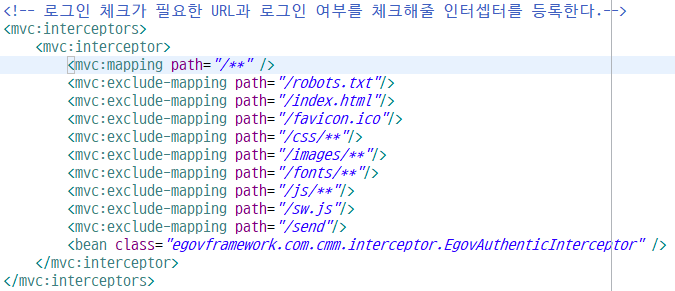
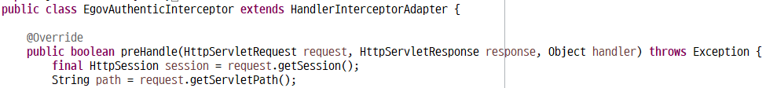

### 로그인 인증 처리(Interceptor)

* Interceptor
  * `Interceptor` 란 컨트롤러에 들어오는 요청 `HttpRequest` 와 컨트롤러가 응답하는 `HttpResponse` 를 가로채는 역할
  * 관리자만 접근할 수 있는 관리자 페이지에 접근하기 전에 관리자 인증을 하는 용도로 활용될 수 있다.
  * 나는 로그인 인증을 처리하는 데에 사용했다.
  

* 환경설정
  * `dispatcher-servlet.xml` 에 다음과 같이 등록을 해준다.
     
    

* 사용법
  * `HandlerInterceptorAdapter `를 상속받아 필요한 메서드만 오버라이딩하면 된다.
  
    

### 참고
* [[Spring] Interceptor (1) - 개념 및 예제](https://victorydntmd.tistory.com/176)