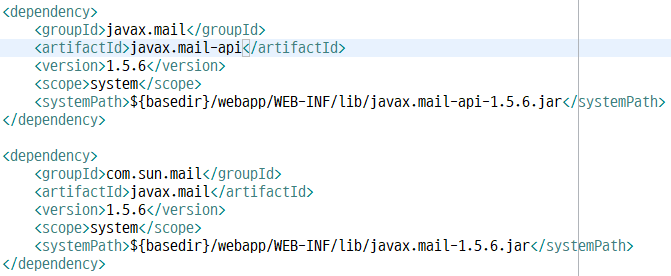
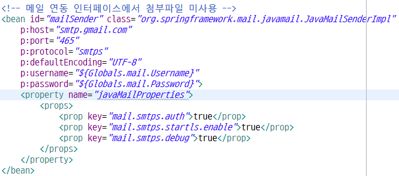
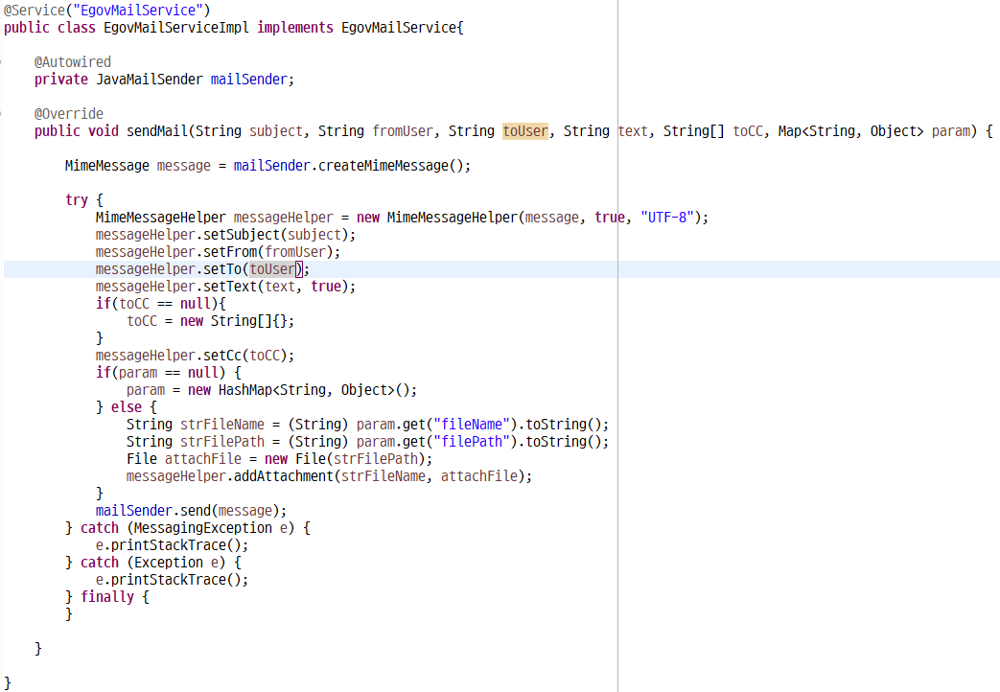
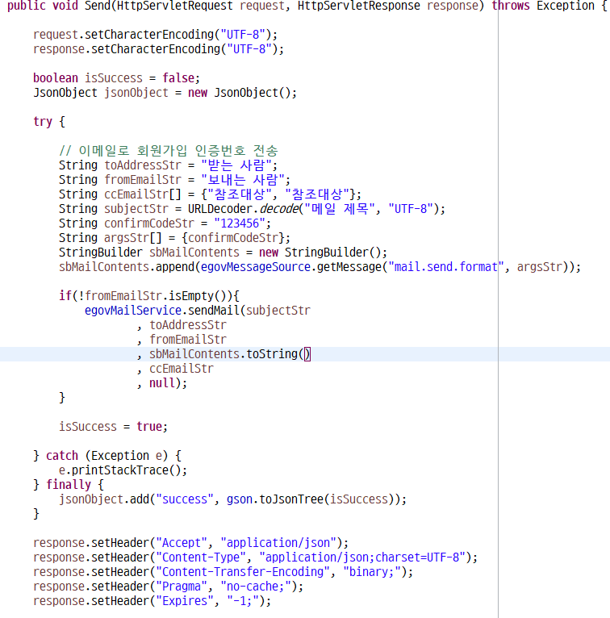

### 메일 전송

* `Spring Framework` 에서 메일 발송하기

* 환경설정
  * `pom.xml` 에 라이브러리 추가
    
    *  `systemPath` 경로 설정과 `scope` 설정은 `jar` 파일을 직접 다운 받았기 때문에 해준 것이다.
  
  * `context-mail.xml` 에 메일 정보 추가
  
    

* 사용법
  * `Service` 및 `ServiceImpl` 를 만들어서 `JavaMailSender` 를 사용하거나
      * 나는 이 방법을 사용했었음.
        
        
        
  *  `Controller` 에서 `JavaMailSender` 를 바로 사용한다.
 