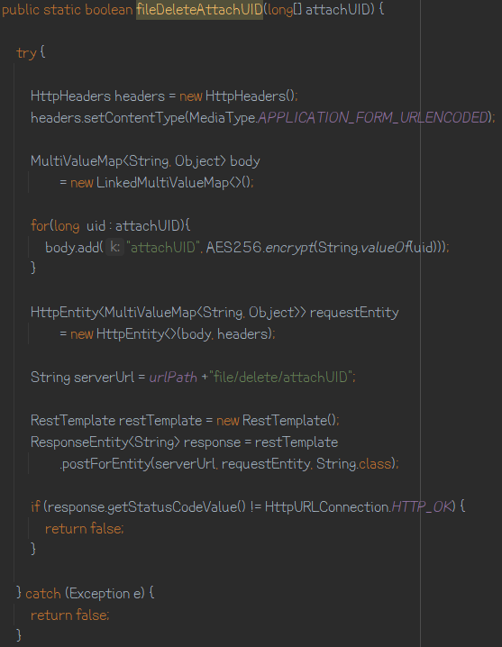
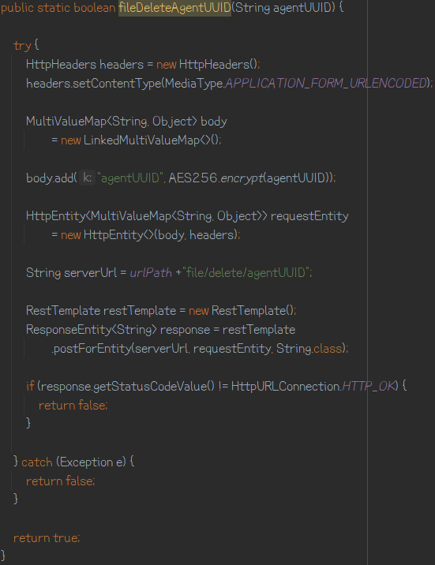
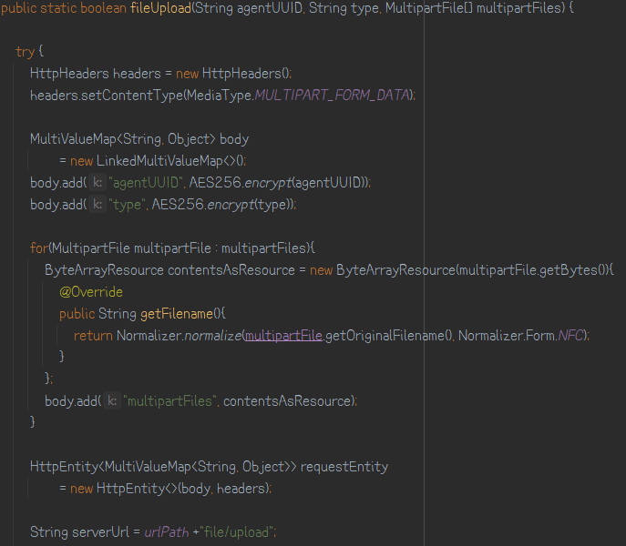
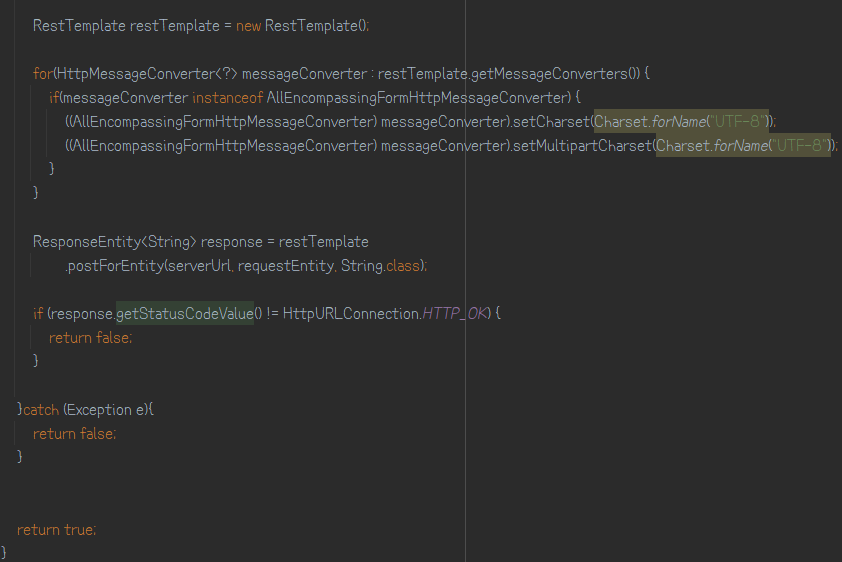
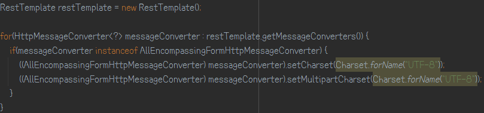

## 백엔드에서 API 요청(RestTemplate)

* 파라미터 배열로 넘겨서 요청하기 (POST)
    * 예제 코드
            

* 파라미터 문자열로 넘겨서 요청하기 (POST)
    * 예제 코드
       

* 파라미터로 MultipartFile 넘겨서 요청하기 (POST)
    * 예제 코드
      
      
      
    *  파일 전송시 한글 파일 명일 경우 파일 명이 깨지는 현상 해결
      
       

### 참고
* [백엔드에서 API 요청하기](https://github.com/eugenp/tutorials/blob/master/spring-web-modules/spring-resttemplate-3/src/main/java/com/baeldung/web/upload/client/MultipartFileUploadClient.java)
* [RestTemplate 파일 전송시 한글 깨짐 현상 해결](https://okky.kr/article/389868)