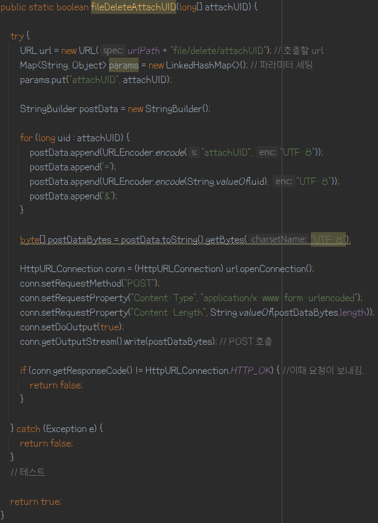
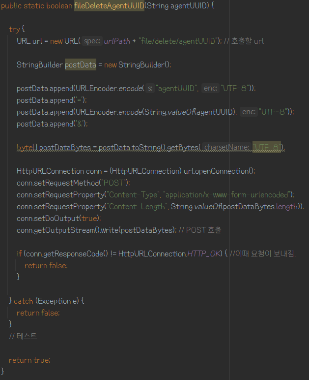
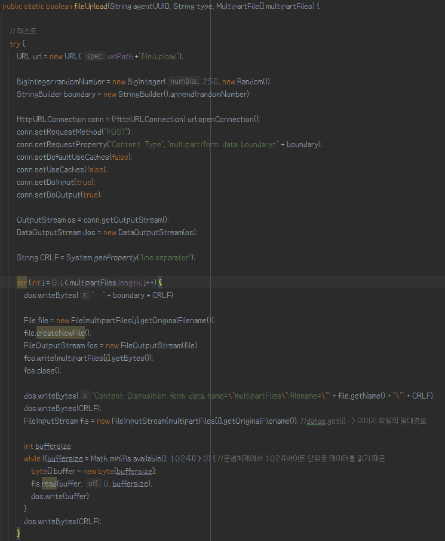
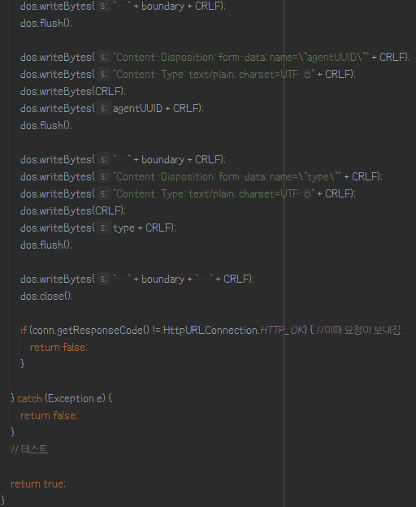

## 백엔드에서 API 요청하기

* 파라미터 배열로 넘겨서 요청하기 (POST)
    * 예제 코드
      
      

* 파라미터 문자열로 넘겨서 요청하기 (POST)
    * 예제 코드
    
  

* 파라미터로 MultipartFile 넘겨서 요청하기 (POST)
    * 예제 코드
      
      
      
    * 이 때, `boundary` 는 구분자로 사용된다. 아무 문자열이면 되는 것으로 파악.