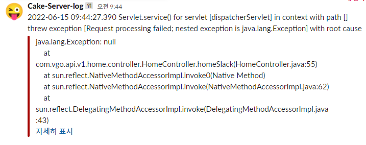

## 에러 발생 시 슬랙으로 전송

### 사용
* 실제 운영 중인 프로젝트(브이고) 내에서 오류가 발생하면 로그 파일을 일일이 뒤져보는 것에 대해 귀찮음과 어려움을 느껴,
  </br>
  에러 발생 시에 슬랙으로 메시지를 전달 받으면 어떨까 하는 생각이 들어서 찾아보게 됨.
 
 
### 사용 방법
#### ✅ 정확한 정보는 참고를 확인! 
1. 슬랙 채널을 생성 하고 앱(수신 웹후크)을 추가한다.
2. 수신 웹후크에서 채널을 연결 한 뒤 `Slack WebHooks URL` 획득
3. 프로젝트 내에 gradle 및 maven 에 의존성 추가 (우리는 maven 추가)
   * gradle
        ```
        implementation 'com.github.maricn:logback-slack-appender:1.4.0'
        ```
     
   * maven
        ```xml
        <dependency>
            <groupId>com.github.maricn</groupId>
            <artifactId>logback-slack-appender</artifactId>
            <version>1.4.0</version>
        </dependency> 
        ```
4. `application.properties` 및 `application.yml` 에 정보 추가
    ```
    logging.slack.webhook-uri= 여기에 추가
    logging.config=classpath:logback-spring.xml
    ```
   
5. `logback-spring.xml` 파일에 코드 추가
   ```xml
   <springProperty name="SLACK_WEBHOOK_URI" source="logging.slack.webhook-uri"/>
   <appender name="SLACK" class="com.github.maricn.logback.SlackAppender">
    <webhookUri>${SLACK_WEBHOOK_URI}</webhookUri>
    <layout class="ch.qos.logback.classic.PatternLayout">
        <pattern>%d{yyyy-MM-dd HH:mm:ss.SSS} %msg %n</pattern>
    </layout>
    <username>Local-Server-log</username>
    <iconEmoji>:stuck_out_tongue_winking_eye:</iconEmoji>
        <colorCoding>true</colorCoding>
   </appender>
   <appender name="ASYNC_SLACK" class="ch.qos.logback.classic.AsyncAppender">
    <appender-ref ref="SLACK"/>
    <filter class="ch.qos.logback.classic.filter.ThresholdFilter">
        <level>ERROR</level>
    </filter>
   </appender>
   
   <root level="INFO">
    <appender-ref ref="CONSOLE"/>
    <appender-ref ref="FILE" /> 
    <appender-ref ref="Error"/>
    <appender-ref ref="ASYNC_SLACK"/>
   </root>
	
   <logger name="org.apache.ibatis" level="INFO" additivity="false"> 
    <appender-ref ref="CONSOLE"/> 
    <appender-ref ref="FILE"/> 
    <appender-ref ref="Error"/>
    <appender-ref ref="ASYNC_SLACK"/>
   </logger>
   ```
   
6. 메시지 확인
   
    

### 출처
* [[Spring] Logback으로 Slack에 Error log 남기는 법](https://devlog-wjdrbs96.tistory.com/327)