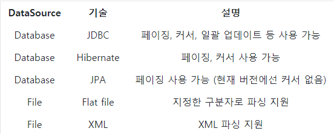

### 배치 어플리케이션이란?
* ```배치(Batch)```는 일괄처리 란 뜻을 갖고 있다.
* 배치 어플리케이션의 조건
    * 대용량 데이터 - 배치 어플리케이션은 대량의 데이터를 가져오거나, 전달하거나, 계산하는 등의 처리를 할 수 있어야 한다.
    * 자동화 - 배치 어플리케이션은 심각한 문제 해결을 제외하고는 사용자 개입 없이 실행되어야 한다.
    * 견고성 - 배치 어플리케이션은 잘못된 데이터를 충돌/중단 없이 처리할 수 있어야 한다.
    * 신뢰성 - 배치 어플리케이션은 무엇이 잘못되었는지를 추적할 수 있어야 한다. (로깅, 알림)
    * 성능 - 배치 어플리케이션은 지정한 시간 안에 처리를 완료하거나 동시에 실행되는 다른 어플리케이션을 방해하지 않도록 수행되어야한다.

### Spring Batch?
* ```Accenture``` 의 배치 노하우 & 기술력과 Spring 프레임워크가 합쳐져 만들어진 것이 ```Spring Batch``` 이다.
* ```Spring``` 의 특성을 그대로 가지고 있다.
* ```DI, AOP,  서비스 추상화``` 등 Spring 프레임워크의 3대 요소를 모두 사용할 수 있으면서, ```Accenture``` 의 ```Batch``` 노하우가 담긴 아키텍처를 사용할 수 있다.
* 현재 ```Spring Bath 4.0 (Spring Boot 2.0)``` 에서 지원하는 ```Reader & Writer``` 는 아래와 같다.
  * ```Reader``` 는 데이터를 읽어오는 모듈이며, ```Writer```는 데이터를 쓰는 모듈이라고 생각하면 된다.
  
  