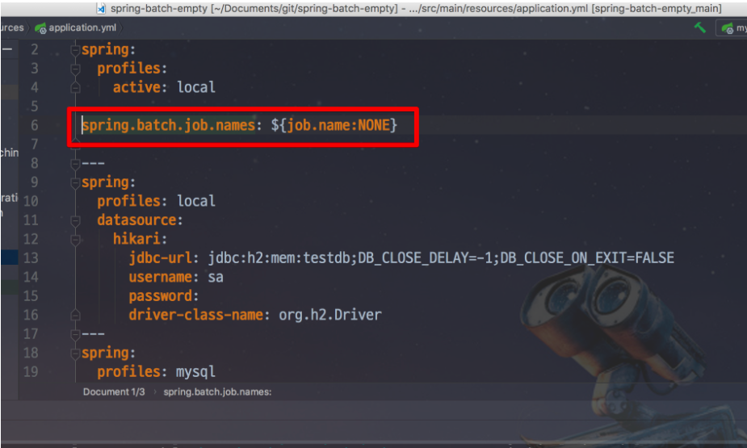
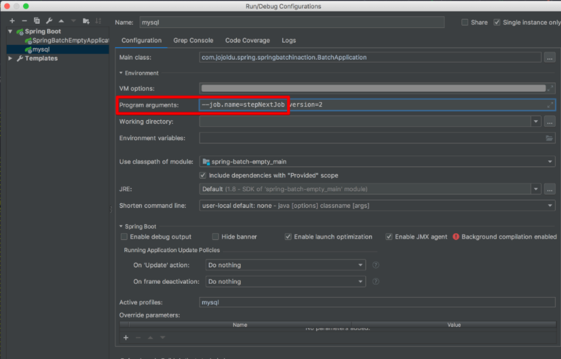
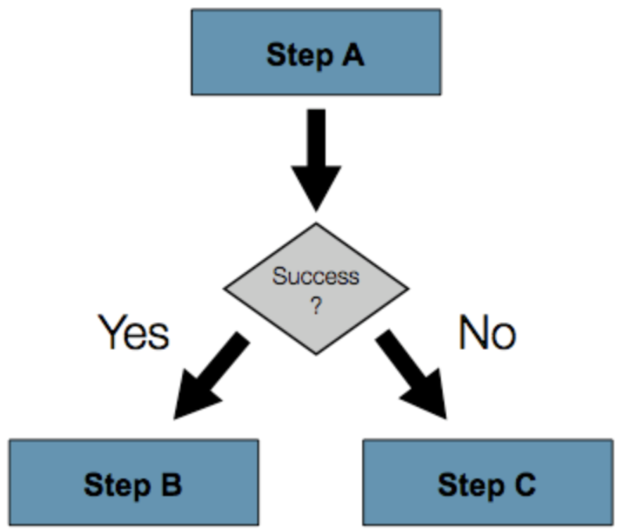

### Job Flow
* ```Spring Batch```의 ```Job```을 구성하는데는 ```Step```이 있는데,
```Step```은 실제 ```Batch```작업을 수행하는 역할을 한다.
* ```Step```에서는 ```Batch```로 실제 처리하고자 하는 기능과 설정을 모두 포함하는 장소라고 생각하면 된다.
* ```Step```에서 ```Batch```의 처리 내용을 담다보니, ```Job```내부의 ```Step```들간에 순서 혹은 처리 흐름을 제어할 필요가 있다.

### Next
* 예시
    ```
    @Bean
    public Job stepNextJob() {
        return jobBuilderFactory.get("stepNextJob")
                .start(step1())
                .next(step2())
                .next(step3())
                .build();
    }
    ```
  
* ```next()```는 순차적으로 ```Step```들을 연결시킬 때 사용된다.


### 번외 1. 지정한 Batch Job만 실행되도록 하는 방법
* 예시
  
  
* ```Spring Batch```가 실행될때, ```Program arguments```로 ```job.name``` 값이 넘어오면 해당 값과 일치하는 ```Job```만 실행하겠다는 것
* 이때
  * ```${job.name:NONE}```은 ```job.name```이 있으면 ```job.name```값을 할당하고, 없으면 ```none```을 할당하겠다는 의미이다.
  * 중요한 것은! ```spring..batch.job.names```에 ```NONE```이 할당되면 어떤 배치도 실행하지 않겠다는 의미이다.
  * 즉, 혹시라도 값이 없을 때 모든 배치가 실행되지 않도록 막는 역할이다.
* 이것을 사용하려면 IDE의 실행환경도 수정을 해주어야한다.
  
  

### 조건별 흐름 제어(Flow)
* ```next()```는 앞의 ```step```에서 오류가 나면 나머지 뒤에 있는 ```step```들은 실행되지 못한다.
* 하지만 상황에 따라 정상일 때는 ```Step B```로, 오류가 났을 때는 ```Step C```로 수행해야할 때가 있다.
  
  
* 이럴 경우를 대비해 ```Spring Batch Job```에서는 조건별로 ```Step```을 사용할 수 있다.
