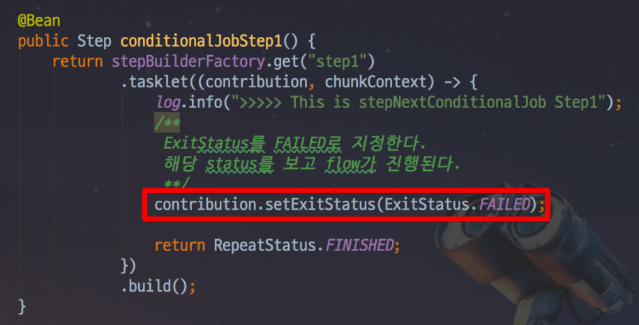
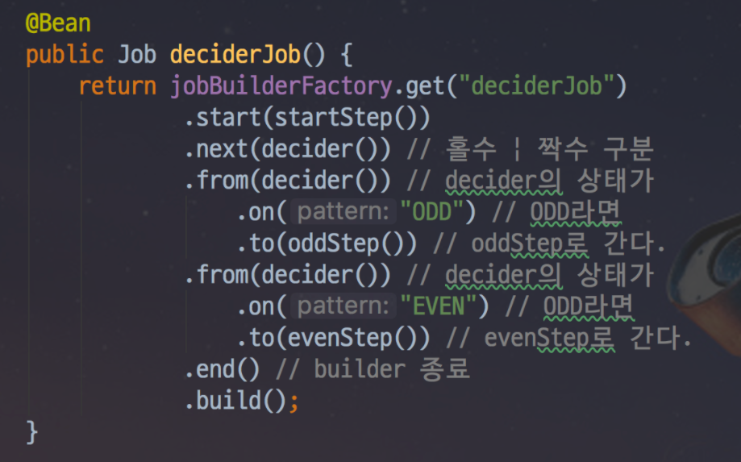
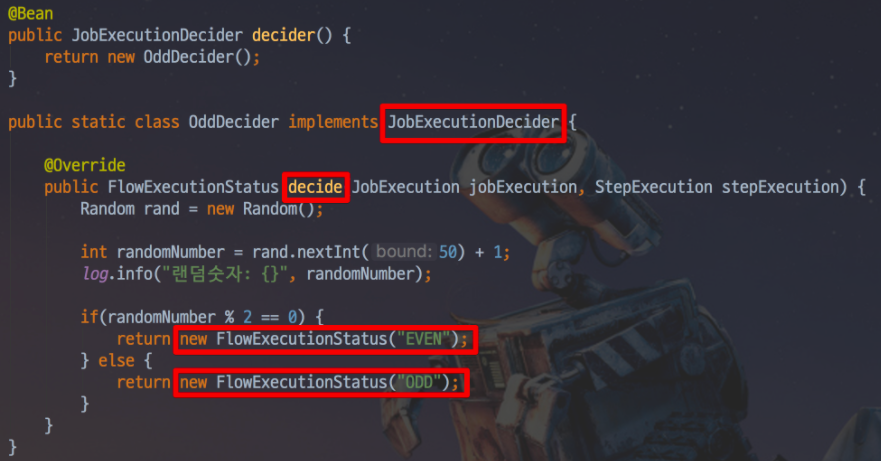

### Job Flow
* `Spring Batch`의 `Job`을 구성하는데는 `Step`이 있는데,
`Step`은 실제 `Batch`작업을 수행하는 역할을 한다.
* `Step`에서는 `Batch`로 실제 처리하고자 하는 기능과 설정을 모두 포함하는 장소라고 생각하면 된다.
* `Step`에서 `Batch`의 처리 내용을 담다보니, `Job`내부의 `Step`들간에 순서 혹은 처리 흐름을 제어할 필요가 있다.

### Next
* 예시
    `
    @Bean
    public Job stepNextJob() {
        return jobBuilderFactory.get("stepNextJob")
                .start(step1())
                .next(step2())
                .next(step3())
                .build();
    }
    `
  
* `next()`는 순차적으로 `Step`들을 연결시킬 때 사용된다.


### 번외 1. 지정한 Batch Job만 실행되도록 하는 방법
* 예시
  
  
* `Spring Batch`가 실행될때, `Program arguments`로 `job.name` 값이 넘어오면 해당 값과 일치하는 `Job`만 실행하겠다는 것
* 이때
  * `${job.name:NONE}`은 `job.name`이 있으면 `job.name`값을 할당하고, 없으면 `none`을 할당하겠다는 의미이다.
  * 중요한 것은! `spring..batch.job.names`에 `NONE`이 할당되면 어떤 배치도 실행하지 않겠다는 의미이다.
  * 즉, 혹시라도 값이 없을 때 모든 배치가 실행되지 않도록 막는 역할이다.
* 이것을 사용하려면 IDE의 실행환경도 수정을 해주어야한다.
  
  

### 조건별 흐름 제어(Flow)
* `next()`는 앞의 `step`에서 오류가 나면 나머지 뒤에 있는 `step`들은 실행되지 못한다.
* 하지만 상황에 따라 정상일 때는 `Step B`로, 오류가 났을 때는 `Step C`로 수행해야할 때가 있다.
  
  
* 이럴 경우를 대비해 `Spring Batch Job`에서는 조건별로 `Step`을 사용할 수 있다.
* 예시
    ```
    @Bean
    public Job stepNextConditionalJob() {
        return jobBuilderFactory.get("stepNextConditionalJob")
                .start(conditionalJobStep1())
                    .on("FAILED") // FAILED 일 경우
                    .to(conditionalJobStep3()) // step3으로 이동한다.
                    .on("*") // step3의 결과 관계 없이 
                    .end() // step3으로 이동하면 Flow가 종료한다.
                .from(conditionalJobStep1()) // step1로부터
                    .on("*") // FAILED 외에 모든 경우
                    .to(conditionalJobStep2()) // step2로 이동한다.
                    .next(conditionalJobStep3()) // step2가 정상 종료되면 step3으로 이동한다.
                    .on("*") // step3의 결과 관계 없이 
                    .end() // step3으로 이동하면 Flow가 종료한다.
                .end() // Job 종료
                .build();
    }  
    ```
  * `.on()`
    * 캐치할 `ExitStatus` 지정
    * `*` 일 경우 모든 `ExitStatus`가 지정된다.
  * `to()`
    * 다음으로 이동할 `Step` 지정
  * `from()`
    * 일종의 이벤트 리스너 역할
    * 상태 값을 보고 일치하는 상태라면 `to()`에 포함된 `step`을 호출한다.
    * `step1`의 이벤트 캐치가 `FAILED`로 되있는 상태에서 추가로 이벤트 캐치하려면 `from`을 써야만 함.
  * `end()`
    * `end`는 `FlowBuilder`를 반환하는 `end`와 `FlowBuilder`를 종료하는 `end` 2개가 있음.
    * `on(*)` 뒤에 있는 `end`는 `FlowBuilder`를 반환하는 `end`
    * `build()`  앞에 있는 `end`는 `FlowBuilder`를 종료하는 `end`
 * 여기서 중요한 점은 `on`이 캐치하는 상태 값이 `BatchStatus`가 아닌 `ExitStatus`라는 점이다.
    * 분기 처리를 위해 상태 값 조정이 필요하다면 `ExitStatus`를 조정해야한다.
    
    * 본인이 원하는 상황에따라 분기로직을 작성하여 `contribution.setExitStatus`의 값을 변경해주면 된다.
  

### 번외 2. Batch Status vs Exit Status
* `BatchStatus` 와 `ExitStatus`의 차이를 아는 것이 중요하다.
* `BatchStatus`
  * `Job` 또는 `Step`의 실행 결과를 `Spring`에서 기록할 때 사용하는 `Enum`이다.
  * 사용 되는 값은 `COMPLETED, STARTING, STARTED, STOPPING, STOPPED, FAILED, ABANDONED, UNKNOWN`이 있다.
* `ExitStatus`
  * `Step`의 실행 후 상태를 얘기한다.
  * `ExitStatus`는 `Enum`이 아니다.
* `JobFlow`에서 사용하는 `on` 메소드가 참조하는 것은 `BatchStatus`가 아니라 `Step`의 `ExitStatus` 이다.
* `Spring Batch`는 기본적으로 `ExitStatus`의 `exitCode`는 `Step`의 `BatchStatus`와 같도록 설정이 되어있다.
    * 본인만의 커스텀한 `exitCode`가 필요하다면 커스텀한 `exitCode`를 반환하는 별도의 로직(`Listener`생성 및 등록)이 필요하다.


### Decide
* 위의 분기 처리 방식은 2가지 문제가 있다.
    * `Step`이 담당하는 역할이 2개 이상이 된다.
        * 실제 해당 `Step`이 처리해야할 로직외에도 분기처리를 시키기 위해 `ExitStatus` 조작이 필요하다.
    * 다양한 분기 로직 처리의 어려움
        * `ExitStatus`를 커스텀하게 고치기 위해선 `Listener`를 생성하고, `Job Flow`에 등록하는 등 번거로움이 존재한다.
* `JobExecutionDecider `는 `Step`들간의 `Flow`분기만 담당하면서 다양한 분기처리가 가능한 타입이다.
* 예시)
   
    * `start()`
        * `Job Flow`의 첫번째 `Step`을 시작한다.
    * `next()`
        * `startStep`이후에 `decider`를 실행한다.
    * `from()`
        * 위의 분기 처리 방식과 마찬가지로 `from`은 이벤트 리스너 역할을 한다.
        * `decider`의 상태 값을 보고 일치하는 상태라면 `to()`에 포함된 `step`를 호출한다.
* 복잡한 분기로직이 필요하더라도 `Step`과는 명확히 역활과 책임이 분리된 채 진행 할 수 있다. 
* 주의할 점은 `Step`으로 처리하는 것이 아니기 때문에, `ExitStatus`가 아닌 `FlowExecutionStatus`로 상태를 관리한다.
    