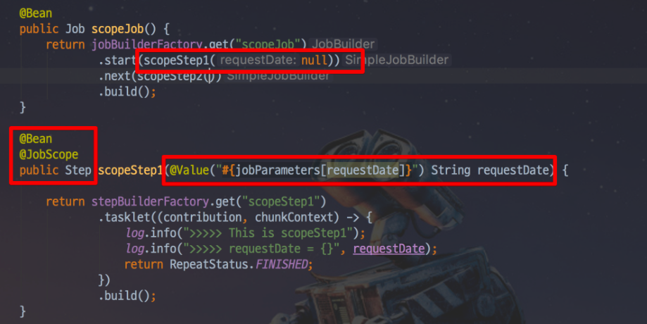
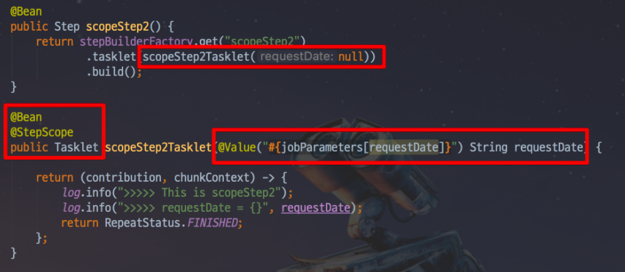

### JobParameter 와 Scope
* `JobParameter`
    * 외부 혹은 내부에서 파라미터를 받아 `Batch` 컴포넌트에서 사용할 수 있게 지원하는 파라미터.
    * 사용법
        * `@Value("#{jobParameters[파라미터명]}")` `SpEL`로 선언해서 사용하면 된다.
    * `JobParameter`를 사용하기 위해선 항상 `Spring Batch`전용 `Scope`를 선언해야만 한다.
        * 크게 `@StepScope` 와 `@JobScope` 가 있다.
        * `JobParameter` 외에도 `jobExecutionContext`, `stepExecutionContext` 등도 `SpEL`로 사용할 수 있다.
        * `@JopScope` 에선 `stepExecutionContext`는 사용 할 수 없고, `jobParameter`와 `jobExecutionContext`만 사용할 수 있다.
    * 사용할 수 있는 타입은 `Double, Long, Date, String` 이 있고, `LocalDate, LocalDateTime`은 사용이 불가능해 `String`으로 변환해서 사용해야한다.

* `JobScope`
    * 예제)
        
    * `JobScope`는 `Step`선언문에서 사용이 가능하다.  
      

* `StepScope`
    * 예제)
        
    * `StepScope`는 `Tasklet`이나 `ItemReader`, `ItemWriter`, `ItemProcessor`에서 사용이 가능하다.  
    

### @StepScope & @JobScope 소개
* `Spring Bean`의 기본 `Scope`는 `Singleton`이지만, `Spring Batch` 컴포넌트인(`Tasklet, ItemReader, ItemWriter, ItemProcessor` 등)에
    `@StepScope`를 사용하게 되면 `Spring Batch`가 `Spring` 컨테이너를 통해 지정된 `Step`의 실행시점에 해당 컴포넌트를
    `Spring Bean`으로 생성한다.
* 마찬가지로 `@JobScope`는 `Job`실행시점에 `Bean`이 생성된다.
* 즉, `Bean`의 생성 시점을 지정된 `Scope`가 실행되는 시점으로 지연시킨다.
* `Bean`의 생성시점을 `Step` 혹은 `Job`의 실행시점으로 지연시키면서 얻는 장점
    1. `JobParameter`의 `Late Binding(동적 바인딩)`이 가능하다.
        * `Job Parameter`가 `StepContext` 또는 `JobExecutionContext` 레벨에서 할당시킬 수 있다. 
        * 꼭` Application`이 실행되는 시점이 아니더라도 `Controller`나 `Service`와 같은 비지니스 로직 처리 단계에서 `Job Parameter`를 할당시킬 수 있다.
    2. 동일한 컴포넌트를 병렬 혹은 동시에 사용할 때 유용하다.
        * 예시)  
          1. `@StepScope` 없이 `Step`을 병렬로 실행시키게 되면 서로 다른 `Step`에서 하나의 `Tasklet`을 두고 마구잡이로 상태를 변경하려고 할 것이다. 
          2. 하지만, `StepScope`가 있다면 각각의 `Step`에서 별도의 `Tasklet`을 생성하고 관리하기 때문에 서로의 상태를 침범할 일이 없다.

### Job Parameter 오해
* `JobParameter`는 `Step, Tasklet, Reader` 등 `Batch` 컴포넌트 `Bean`의 생성 시점에 호출 할 수 있지만, 정확히는 `Scope Bean`을 생성할 때만 가능하다.
* 즉, `@StepSocpe, @JobScope Bean` 을 생성할 때만 `Job Parameters`가 생성되기 때문에 사용할 수 있다.
* `Bean`을 메소드나 클래스 어느 것을 통해서 생성해도 무방하나 `Bean`의 `Scope`는 `Step, Job` 이어야 한다.
* 주의) `JopParameters`를 사용하기 위해선 꼭 `@StepScope, @JobScope`로 `Bean`을 생성해야 한다.

### JobParameters 와 시스템 변수의 차이
1. 시스템 변수를 사용할 경우 `Spring Batch`의 `Job Parameter` 관련 기능을 못 쓰게 된다.
    * 예를 들어, `Spring Batch`는 같은 `JobParameters`로 같은 `Job`을 두 번 실행하지 않는다. 하지만 시스템 변수를 사용할 경우 이 기능이 전혀 작동하지 않는다.
    * `Spring Batch`에서 자동으로 관리해주는 `Parameter` 관련 메타 테이블이 전혀 관리되지 않는다.
    * 특히, `Job Parameter`를 못쓰게 된다는 것은 `Late Binding(동적 바인딩)`을 못하게 된다는 의미이다.
2. `Command Line`이 아닌 다른 방법으로 `Job`을 실행하기가 어렵다.
    * 실행을 해야 한다면 전역 상태 (시스템 변수 혹은 환경 변수)를 동적으로 계속해서 변경 시킬 수 있도록 `Spring Batch`를 구성해야한다.
      * 이 경우 동시에 여러 `Job`을 실행하려는 경우 또는 테스트 코드로 `Job`을 실행해야할 때 문제가 발생할 수 있다.

* `Job Parameter`를 사용 시에는 개발자가 원하는 어느 타이밍이든 `Job Parameter`를 생성하고 `Job`을 수행할 수 있다.
* `Job Parameter`를 각각의 `Batch` 컴포넌트들이 사용하면 되니 변경이 심한 경우에도 쉽게 대응이 가능하다.
    >  이때, 웹서버에서 `Batch`를 관리하는 것은 권장 하지 않는다.

### 참고 
[5. Spring Batch 가이드 - Spring Batch Scope & Job Parameter](https://jojoldu.tistory.com/330?category=902551)
 
 
