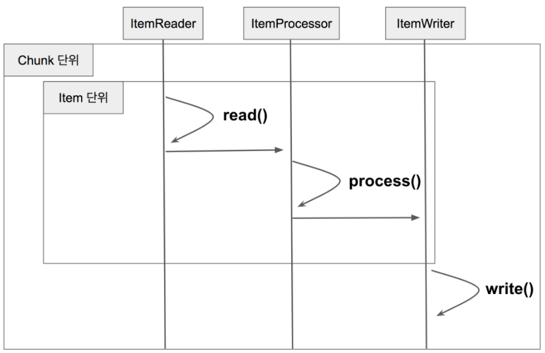

### Chunk?
* `Spring Batch`에서의 `Chunk`란 데이터 덩어리로 작업 할 때 각 커밋사이에 처리되는 `row` 수
* 즉, `Chunk`지향 처리란 한 번에 하나씩 데이터를 읽어 `Chunk`라는 덩어리를 만든 뒤, `Chunk` 단위로 트랜잭션을 다루는 것을 의미한다.
* 여기서 트랜잭션이 중요한데, `Chunk`단위로 트랜잭션을 수행하기 때문에 실패할 경우엔 해당 `Chunk`만큼만 롤백이 되고, 이전에 커밋된 트랜잭션 범위까지는
    적용이 된다.
  
    
    * `Reader`에서 데이터를 하나 읽어온다.
    * 읽어온 데이터를 `Processor`에서 가공한다.
    * 가공된 데이터들을 별도의 공간에 모은 뒤, `Chunk`단위만큼 쌓이게 되면 `Writer`에 전달하고 `Writer`는 일괄 저장한다.
* `Reader`와 `Processor`에서는 1건씩 다뤄지고, `Writer`에선 `Chunk`단위로 처리된다는 것만 기억하면 된다.    

### ChunkOrientedTasklet 
* `Chunk` 지향 처리의 전체 로직을 다루는 클래스.
* `execute()`
    * `Chunk` 단위로 작업하기 위한 전체 코드가 이 곳에 있다.
* `chunkProvider.provide()`
    * `Reader`에서 `Chunk size`만큼 데이터를 가져온다.
* `chunkProcessor.process()`
    * `Reader`로 받은 데이터를 `가공(Processor)`하고 `저장(Writer)`한다.
    * `chunkProvider.provide()`
      * `inputs`이 `ChunkSize`만큼 쌓일 때까지 `read()`를 호출한다.
      *  `read()`내부에서는 실제로 `ItemReader.read()`를 호출한다.
      * 즉, `ItemReader.read()`에서 1건씩 데이터를 조회해 `Chunk size`만큼 데이터를 쌓는 것은 `provide()`가 하는 일이다.

### SimpleChunkProcessor
* `Processor`와 `Writer` 로직을 담고 있는 것은 `ChunkProcessor`가 담당한다
    * `ChunkProcessor`는 인터페이스이기 때문에 실제 구현체가 있어야 하는데, 기본적으로 사용되는 것이 `SimpleChunkProcessor`이다.
* `process()`
    * `Spring Batch`에서 `Chunk`단위 처리를 담당하는 핵심 로직이다.
    * `Chunk<T> inputs`를 파라미터로 받는다.
      * 이 데이터는 앞 서 `chunkProvier.provide()`에서 받은 `ChunkSize`만큼 쌓인 `item`이다.
    * `transform()`
      * 전달 받은 `inputs`을 `doProcess()`로 전달하고 변환 값을 받는다.
      * 가공된 대량의 데이터는 `wrtie()`를 통해 일괄 저장한다.
        * `write()`는 저장이 될 수도 있고, `외부 API`로 전송할 수도 있다.
        * 개발자가 `ItemWriter`를 어떻게 구현했는지에 따라 달라진다   
        * `doProcess()`
            * 처리하는데 만약 `ItemProcessor`가 없다면 `Item`을 그대로 반환하고 있다면 `ItemProcessor`의 `process()`로 가공하여 반환한다.
* 이렇게 가공된 데이터들은 `SimpleChunkProcessor`의 `doWrtie()`를 호출하여 일괄 처리한다.

### Page Size vs Chunk Size
* `Page Size`
    * 한 번에 조회할 `Item`의 양
    * 페이징 쿼리에서 `Page`의 `Size`를 지정하기 위한 값.
* `Chunk Size`
    * 한 번에 처리될 트랜잭션 단위
* 예)
    * `PageSize` 가 10이고, `ChunkSize`가 50이라면 `ItemReader`에서 `Page`조회가 5번 일어나면 1번의 트랜잭션이 발생하여
        `Chunk`가 처리된다
* 한번의 트랜잭션 처리를 위해 5번의 쿼리 조회가 발생하기 때문에 성능상 이슈가 발생할 수 있다.
* 성능상 이슈 외에도 2개 값을 다르게 할 경우 `JPA`를 사용한다면 영속성 컨텍스트가 깨지는 문제도 발생
    * [Spring Batch에서 영속성 컨텍스트 문제 (processor에서 lazyException 발생할때)](https://jojoldu.tistory.com/146)
* 2개 값이 의미하는 바가 다르지만 위에서 언급한 여러 이슈로 2개 값을 일치시키는 것이 보편적으로 좋은 방법이니 꼭 2개 값을 일치하길 추천한다.
