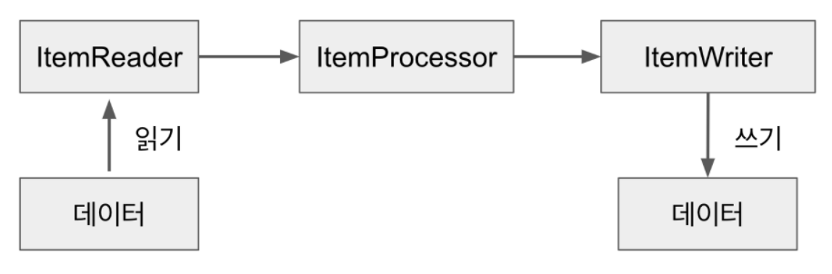
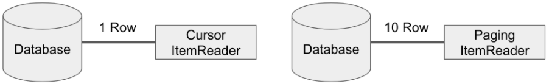
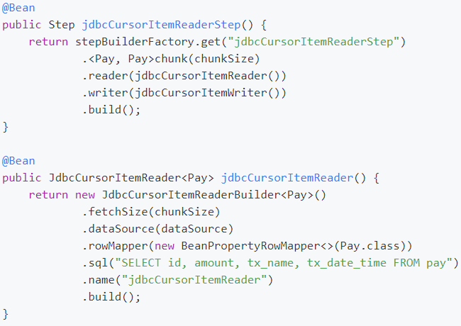
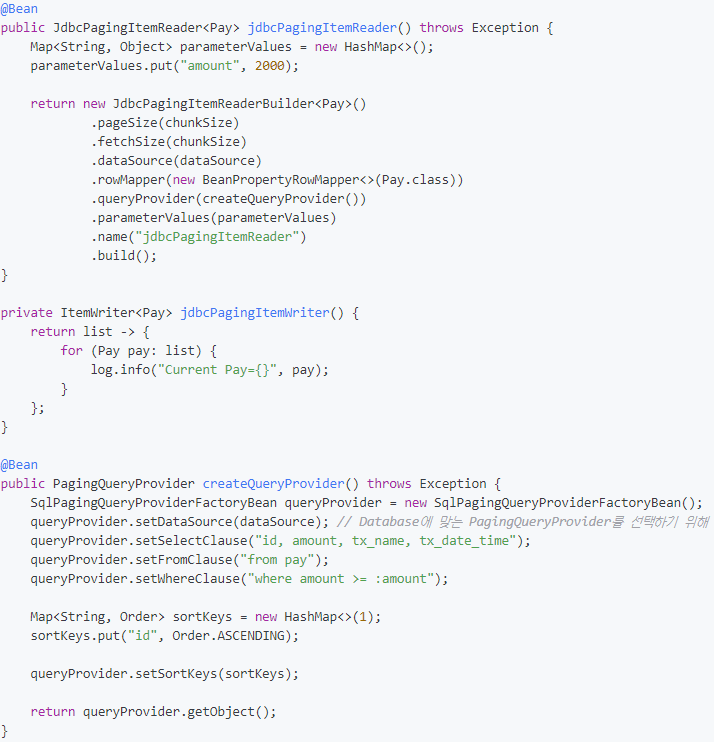
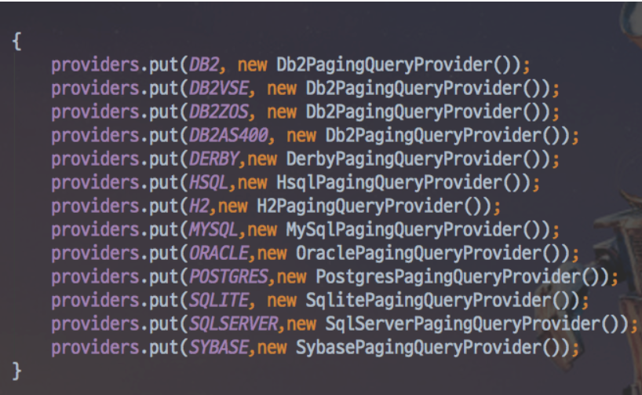
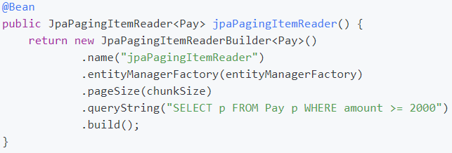

 ### 서론
* `Spring Batch`가 `Chunk`지향 처리를 하고 있으며, 이를 `Job`과 `Step`으로 구성되어 있음을 배웠다.
* `Step`은 `Tasklet`단위로 처리되고, `Tasklet`중 에서 `ChunkOrientedTasklet`을 통해 `Chunk`를 처리하며 이를 구성하는 3요소로
    `ItemReader`,`ItemWriter`,ItemProcessor`가 있음을 배웠다.
    > 즉, `ItemReader & ItemWrtier & ItemProcessor`의 묶음 역시 `Tasklet`이란 이야기이다.
  > 이들의 묶음을 `ChunkOrientedTasklet`에서 관리하기 때문이다.
* `Spring Batch`의 `Chunk Tasklet`의 과정
    

### ItemReader 소개
* `DB, File, XML, JSON 등 ` 데이터 소스의 데이터를 읽어들인다.
* `JMS (Java Message Service)`와 같은 다른 유형의 데이터 소스도 지원한다.
* `Spring Batch`에서 지원하지 않는 `Reader`가 필요 할 경우 직접 해당 `Reader`를 만들 수도 있다.
    * `Spring Batch`는 이를 위해 `Custom Reader`구현체를 만들기 쉽게 제공한다.
* `Spring Batch`의 `Reader`에서 읽어올 수 있는 데이터 유형
    * 입력 데이터에서 읽어오기
    * 파일에서 읽어오기
    * `Database`에서 읽어오기
    * `Java Message service` 등 다른 소스에서 읽어오기
    * 본인만의 커스텀한 `Reader`로 읽어오기
* 개발자는 `ItemReader`와 `ItemStream` 인터페이스를 직접 구현해서 원하는 형태의 `ItemReader`를 만들 수 있다.
    하지만, `Spring Batch`에서 대부분의 데이터 형태는 `ItemReader`로 이미 제공하고 있기 때문에 커스텀한 `ItemReader`를 구현할 일이 별로 없을 것이다.
    > 단, 본인의 조회 프레임워크가 `Querydsl`, `Jooq`라면 직접 구현해야할 수도 있습니다.
  웬만하면 `JdbcItemReader`로 해결되지만, `JPA`의 영속성 컨텍스트가 지원이 안되서 `HibernateItemReader`를 이용하여 `Reader` 구현체를 직접 구현하셔야 합니다.

### 가장 대표적인 구현체인 JdbcPagingItemReader 살펴보기
* `ItemReader` 와 `ItemStream` 인터페이스를 같이 구현하고 있다.
* `ItemReader`
    * `read()`메서드로 데이터를 읽어온다.
* `ItemStream`
    * 주기적으로 상태를 저장하고 오류가 발생하면 해당 상태에서 복원하기 위한 마커 인터페이스이다.
    * 즉, 배치 프로세스의 실행 컨텍스트와 연계해서 `ItemReader`의 상태를 저장하고 실패한 곳에서 다시 실행할 수 있게 해주는 역할.
    * `open(). close()`는 스트림을 열고 닫는다,
    * `update()`를 사용하면 `Batch`처리의 상태를 업데이트 할 수 있다.

### Database Reader
* `Spring` 프레임워크의 강점 중 하나느 개발자가 비즈니스 로직에만 집중할 수 있도록 `JDBC`와 같은 문제점을 추상화한 것이다.
    > 이를 보고 서비스 추상화라고 한다.
* `Spring Batch`개발자들은 `Spring`프레임워크의 `JDBC`기능을 확장해, `Spring`의 `JdbcTemplate`의 문제점(분할처리를 지원하지 않아 직접 `limit, offset`사용하는 등의 작업)을
  해결하기 위해 2개의 `Reader`타입을 지원한다.
  
  * `CursorItemReader`
      * 실제 `JDBC ResultSet`의 기본기능으로, `ResultSet`이 `Open`될 때마다 `next()`메소드가 호출 되어 `Database`의 데이터가 반환된다.
      * 이를 통해 필요에 따라 `Database`에서 데이터를 `Streaming`할 수 있다.
      * `JdbcCursorItemReader, HibernateCursorItemReader, StoredProcedureItemReader` 가 있다.
  *  `PaginItemReader`
      * `Paging` 개념은 페이지라는 `Chunk`로 `Database`에서 데이터를 검색하는 것이다.
      * 즉, 페이지 단위로 한번에 데이터를 조회해오는 방식이다. (좀 더 많은 작업을 필요로 한다.)
      * `JdbcPagingItemReader, HibernatePagingItemReader, JpaPagingItemReader`가 있다.
  * `Cursor`방식은 `Database`와 커넥션을 맺은 후, `Cursor`를 한 칸씩 옮기면서 지속적으로 데이터를 가져오지만, `Paging`방식에서는 한 번에 10개(혹은 개발자가 지정한 `PagingSize`)만큼
    데이터를 가져온다.
    

### CursorItemReader
* `Database`와 어플리케이션 사이에 통로를 하나 연결하고 하나씩 빨아들이는 방식.
* `JdbcCursorItemReader`
    * `reader`는 `Tasklet`이 아니기 때문에 `reader`만으로는 수행 될 수 없다.
    
      * `chunk`
          * `<Pay,Pay>`에서 첫 번째 `Pay`는 `Reader`에서 반환할 타입이며, 두 번째 `Pay`는 `Writer`에 파라미터로 넘어올 타입이다.
          * `chunkSize`로 인자 값을 넣은 경우는 `Reader & Writer`가 묶일 `Chunk` 트랜잭션 범위이다.
      * `fetchSize`
          * `Database`에서 한번에 가져올 데이터 양을 나타낸다.
          * `Cursor`는 쿼리는 분할 처리 없이 실행되나 내부적으로 가져오는 데이터는 `FetchSize`만큼 가져와 `read()`를 통해서 하나씩 가져온다.
      * `rowMapper`
          * 쿼리 결과를 `Java`인스턴스로 매핑하기 위한 `Mapper`이다.
          * 커스텀하게 생성해서 사용이 가능하지만, 보통 `Spring`에서 공식적으로 지원하는 `BeanPropertyRowMapper.class`를 많이 사용한다.
    * 가장 큰 장점은 데이터를 `Streaming`할 수 있다는 것이다.
    * 고성능의 배치 처리 핵심
        * `read()` 메소드는 데이터를 하나씩 가져와 `ItemWriter`로 데이터를 전달하고, 다음 데이터를 가져오는데,
      이를 통해 `reader & processor & writer`가 `Chunk`단위로 수행되고 주기적으로 `Commit`된다.
* `CursorItemReader`의 주의 사항
    * `Cursor`는 하나의 `Connection`으로 `Batch`가 끝날 때까지 사용되기 때문에, `Batch`가 끝나기전에 `Database`와 어플리케이션의 연결이 먼저 끊어질 수
      있기 때문에 `CursorItemReader`사용시에 `Database`와 `SocketTimeout`을 충분히 큰 값으로 설정해야 한다.
    * 보통 `Batch`수행 시간이 오래 걸리는 경우에는 `PagingItemReader`를 사용하는 게 낫다. 
    * `Paging`의 경우 한 페이지를 읽을때마다 `Connection`을 맺고 끊기 때문에 아무리 많은 데이터라도 타임아웃과 부하 없이 수행될 수 있다.
  

### PagingItemReader
* 여러 쿼리를 실행하여 각 쿼리가 결과의 일부를 가져 오는 방법.
* `Spring Batch`에서는 `offset`과 `limit`을 `PageSize`에 맞게 자동으로 생성 해주지만, 각 쿼리는 개별적으로 실행해야 한다.
* 각 페이지마다 새로운 쿼리를 실행하므로 페이징시 결과를 정렬하는 것이 중요`(order by 사용이 권장)`
* `JdbcPagingItemReader`
    
    * `createQueryProvider()`를 사용하는 이유
      * `JdbcPagingItemReader`는 각 `Database`에는 `Paging`을 지원하는 자체적인 전략들이 있기 때문에, `Spring Batch`에는 각 `Database`의
        `Paging`전략에 맞춰 구현되어야만 한다.
        
        * 이와 같이 각 `Database`에 맞는 `Provider`들이 존재하는데, 이렇게 되면 `Database`마다 `Provider` 코드를 바꿔야하니 불편함이 많다.
        * `Spring Batch`에서는 `SqlPagingQueryProviderFactoryBean`을 통해 `Datasource 설정값`을 보고 위 이미지에서 작성된 `Provider`중 하나를 자동으로 선택하도록 합니다.
    * `parameterValues`
        * 쿼리에 대한 매개 변수 값의 `Map`을 지정한다.
        * `queryProvider.setWhereClause`에서 변수를 어떻게 사용하는 지 알 수 있다.
        * `where`절에서 선언된 파라미터 변수명과 `paramerterValues`에서 선언된 파라미터 변수명이 일치해야만 한다.
    * `Limit` 이 자동으로 추가 된다.`(설정한 pageSize 만큼)`
    * 만약 조회할 데이터가 `Limit` 이상이라면 `offset`으로 적절하게 다음 `fetchSize`만큼 가져올 수 있다.
* `JpaPagingItemReader`
     
    * `JPA`에는 `Cursor`기반 `Database`접근을 지원하지 않는다.
* `PagingItemReader` 주의사항
    * 정렬 `(Ordey by)`가 무조건 포함되어 있어야 한다. 참고 - 
    [Spring Batch Paging Reader시 주의사항](https://jojoldu.tistory.com/166)

### ItemReader 주의 사항
* `JpaRepository`를 `ListItemReader, QueuItemReader`에 사용하면 안된다.
* `Hibernate, JPA` 등 영속성 컨텍스트가 필요한 `Reader`사용시 `fetchSize`와 `ChunkSize`는 같은 값을 유지해야 한다.
    * [Spring Batch에서 영속성 컨텍스트 문제 (processor에서 lazyException 발생할때)](https://jojoldu.tistory.com/146)