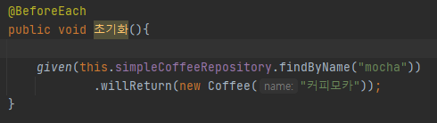
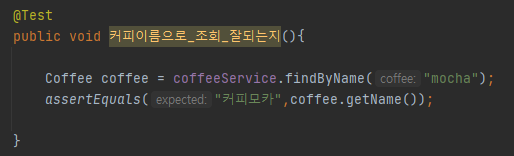

### given

* #### willReturn() 메서드
    
  * given() 메서드 안에 있는 mockRepository.findByname() 메서드는 실제 메서드를 호출 하는 것은 아니고
  * 저 메서드를 호출할때에 willReturn() 메서드 안에 있는 객체를 리턴한다는 뜻이다.
  * 쉽게 말해서 simpleCoffeeRepository.findByname("mocha") 메서드를 호출 하면 new Coffee("커피모카") 이 객체를 무조건 리턴한다는 뜻이다.
    
    