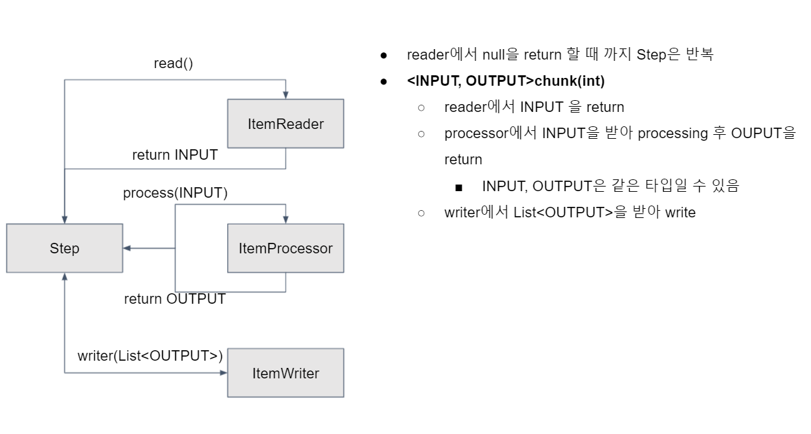

## 스프링 배치 기초 이해하기

### Task 기반 배치와 Chunk 기반 배치
* 배치를 처리할 수 있는 방법은 크게 2가지
* ```Tasklet``` 을 사용한 ```Task``` 기반 처리
    * 배치 처리 과정이 비교적 쉬운 경우 쉽게 사용
    * 대량 처리를 하는 경우 더 복잡
    * 하나의 큰 덩어리를 여러 덩어리로 나누어 처리하기 부적합
* ```Chunk```를 사용한 ```chunk(덩어리)``` 기반 처리 
    * ```ItemReader```, ```ItemProcessor```, ```ItemWriter```의 관계 이해 필요
    * 대량 처리를 하는 경우 Tasklet 보다 비교적 쉽게 구현
    * 예를 들면 10,000개의 데이터 중 1,000개씩 10개의 덩어리로 수행
        * 이를 ```Tasklet```으로 처리하면 10,000개를 한번에 처리하거나, 수동으로 1,000개씩 분할
    
    
    * ```
        @Bean
        @JobScope
        public Step chunkBaseStep(@Value("#{jobParameters[chunkSize]}") String chunkSize) {

            return stepBuilderFactory.get("chunkBaseStep")
                .<String, String>chunk(StringUtils.isNotEmpty(chunkSize) ? Integer.parseInt(chunkSize) : 10)
                .reader(itemReader())
                .processor(itemProcessor())
                .writer(itemWriter())
                .build();
        }
      ```
      * 예시 : ```<String, String>``` 이 ```<INPUT, OUTPUT>``` 인데, 보통 타입이 같다.
    

### JobParameters 이해
* 배치를 실행에 필요한 값을 ```parameter```를 통해 외부에서 주입
* ```JobParameters```는 외부에서 주입된 ```parameter```를 관리하는 객체
* ```parameter```를 ```JobParameters```와 ```Spring EL(Expression Language)```로 접근
    * ```JobParameters``` : ```String parameter = jobParameters.getString(key, defaultValue);```
    * ```Spring EL(Expression Language)``` : ```@Value(“#{jobParameters[key]}”)```  
  
  
* 배치를 실행 시점에 외부에서 주입되는 ```parameter```를 이용해 좀 더 유연한 프로그래밍이 가능하다.


### @JobScope 와 @StepScope 이해
* ```@Scope```는 어떤 시점에 ```bean```을 생성/소멸 시킬 지 ```bean```의 ```lifecycle```을 설정
* 스프링의 기본 ```Scope``` 는 싱글톤 생성주기인데, 애플리케이션이 실행과 동시에 생성되고 종료가 되면 사라진다.
* ```@JobScope```는 ```job``` 실행 시점에 생성/소멸
    * ```Step```에 선언
* ```@StepScope```는 ```step``` 실행 시점에 생성/소멸
    * ```Tasklet```, ```Chunk(ItemReader, ItemProcessor, ItemWriter)``` 에 선언
    * 현재 예제에서는 ```Tasklet``` 과 ```Chunk``` 사용시 ```@Bean``` 선언을 안해주었는데, ```@StepScope``` 을 사용하기 위해서는 선언해 주어야 한다.
* ```Spring```의 ```@Scope```과 같은 것
    * ```@Scope(“job”) == @JobScope```
    * ```@Scope(“step”) == @StepScope```
* ```Job```과 ```Step``` 라이프사이클에 의해 생성되기 때문에 ```Thread safe```하게 작동
* ```@Value(“#{jobParameters[key]}”)```를 사용하기 위해 ```@JobScope```와 ```@StepScope```는 필수
    * ```JopScope``` 와 ```StepScop``` 라이프 사이클 안에 있어야 하기 때문인데, 라이프 사이클이 생성과 소멸에만 관여하는 것이 아닌 걸 알 수 있음.