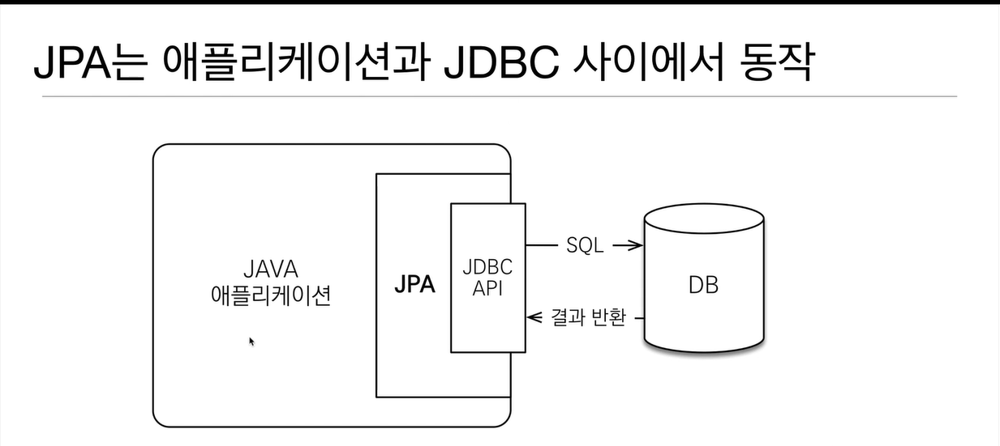
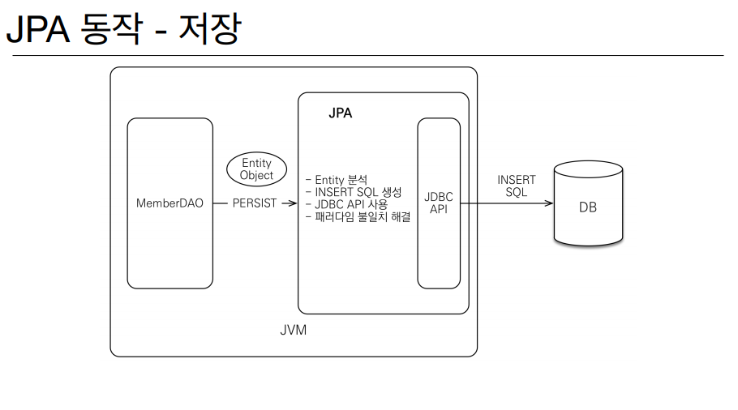
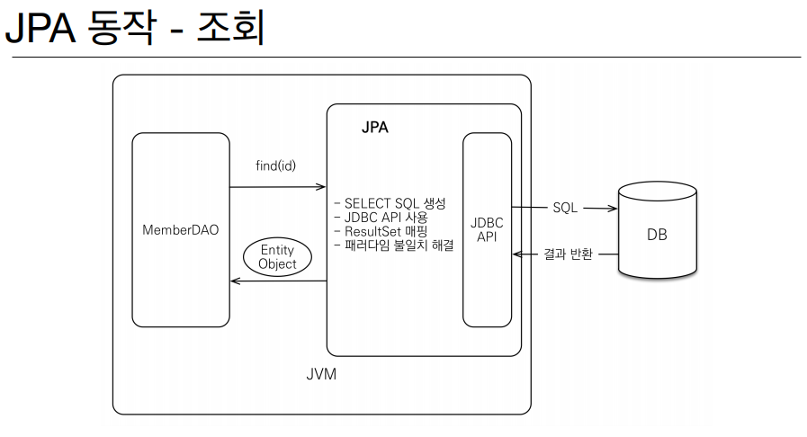
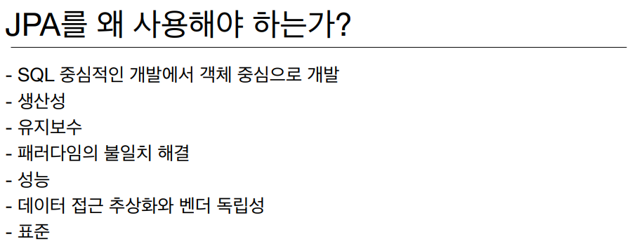
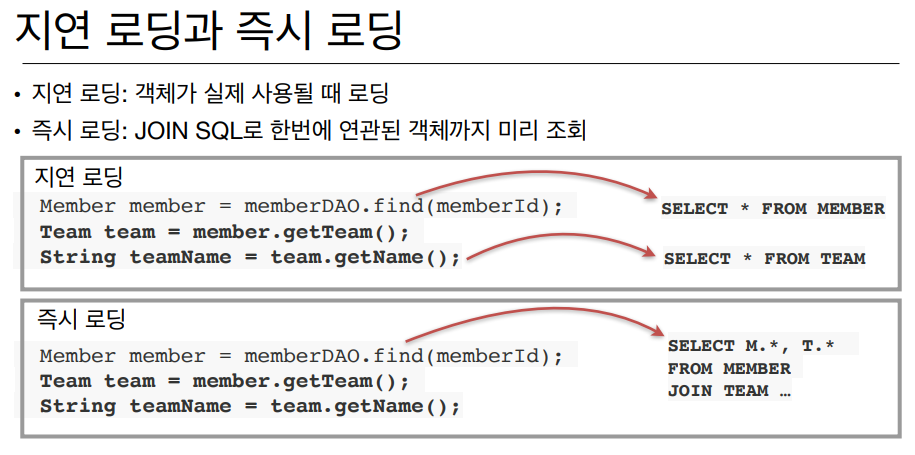

## JPA

* ### JPA 란?
    * Java Persistence API
    * 자바 진영의 ORM 기술 표준
    

* ### ORM 이란?
    * Object-relational mapping(객체 관계 매핑)
    * 객체는 객체대로 설계
    * 관계형 데이터베이스는 관계형 데이터베이스대로 설계
    * ORM 프레임워크가 중간에서 매핑
    * 대중적인 언어에는 대부분 ORM 기술이 존재
    
    
* JPA 는 애플리케이션과 JDBC 사이에서 동작
    
  

* ### JPA 동작 - 저장
    

    * 개발자가 굳이 SQL 을 작성하지 않아도 JPA 가 자동으로 생성해준다.
  

* ### JPA 동작 - 조회
    
  

* ### JPA 를 왜 사용해야 하는가?
    
    
    * 생산성 ( JPA 와 CRUD )
        * 저장 : jpa.persist(member)
        * 조회 : Member member = jpa.find(memberId)
        * 수정 : member.setName("변경할 이름")
        * 삭제 : jpa.remove(member)
    * 유지보수
        * 기존 : 필드 변경시 모든 SQL 수정
        * JPA : 필드만 추가하면 됨, SQL 은 JPA 가 처리
    
    * JPA 와 패러다임의 불일치 해결
        1. JPA 와 상속 - 나머지는 JPA 가 처리
        2. JPA 와 연관관계
        3. JPA 와 객체 그래프 탐색
        4. JPA 와 비교하기 - 동일한 트랜잭션에서 조회한 엔티티는 같음을 보장
    * 신뢰할 수 있는 엔티티, 계층
    * JPA 의 성능 최적화 기능
        1. 1차 캐시와 동일성(identity) 보장
            * 같은 트랜잭션 안에서는 같은 엔티티를 반환 - 약간의 조회 성능 향상 (미세함)
        2. 트랜잭션을 지원하는 쓰기 지연(transactional write-behind)
            * 트랜잭션을 커밋할 때까지 INSERT SQL 을 모음
            * 커밋하는 순간 데이터베이스에 INSERT SQL 을 모아서 보낸다.
            * UPDATE, DELETE 로 인한 로우(ROW)락 시간 최소화
            * 비즈니스 로직 수행 동안 DB 로우 락이 걸리지 않는다.
        3. 지연 로딩(Lazy Loading)
    * 지연 로딩과 즉시 로딩
      
    