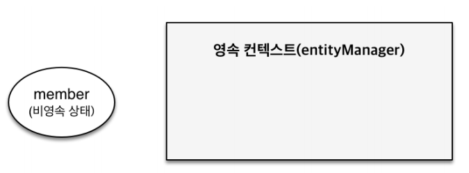

## 영속성 컨텍스트

* ### JPA 에서 가장 중요한 2가지
    * 객체와 관계형 데이터베이스 매핑하기(Object Relational Mapping)
    * 영속성 컨텍스트
    

* ### 엔티티 매니저 팩토리와 엔티티 매니저
    
  

* ### 영속성 컨텍스트
    * JPA 를 이해하는데 가장 중요한 용어
    * ``` 엔티티를 영구 저장하는 환경``` 이라는 뜻
    * ``` EntityManager.persist(entity);```
    * 영속성 컨텍스트는 논리적인 개념으로 눈에 보이지 않는다.
    * 엔티티 매니저를 통해서 영속성 컨텍스트에 접근
    

* ### 엔티티의 생명주기
    * 비영속 (new/transient)
        
        - 영속성 컨텍스트와 전혀 관계가 없는 새로운 상태
        - 객체를 생성한 상태
        - ```
            Member member = new Member();
            member.setId("member1");
            member.setUsername("회원1");
            ```
    * 영속 (managed)
        
        - 영속성 컨텍스트에 관리되는 상태
        - ```
          //객체를 생성한 상태(비영속) 
          Member member = new Member();
          member.setId("member1");
          member.setUsername(“회원1”);
           
          EntityManager em = emf.createEntityManager();
          em.getTransaction().begin();
          
          //객체를 저장한 상태(영속)
          em.persist(member);
          ```
          
    * 준영속, 삭제
        - ```
            //회원 엔티티를 영속성 컨텍스트에서 분리, 준영속 상태 
            em.detach(member); 
          ```
          
        - ```
            //객체를 삭제한 상태(삭제) 
            em.remove(member);
          ```
          
    
* ### 영속성 컨텍스트의 이점
    * 1차 캐시
        * 엔티티를 조회할때, 영속 컨텍스트의 1차 캐시에 있는지를 먼저 조회하고 없으면,
            데이터 베이스에서 조회를 한다.
          
        * 이때 데이터 베이스에서 조회한 값을 영속 컨텍스트의 1차 캐시에 저장한다.
    
    * 영속 엔티티의 동일성 보장
        ```
        Member a = em.find(Member.class, "member1"); 
        Member b = em.find(Member.class, "member1");
        
        System.out.println(a == b); //동일성 비교 true
        ```
        * 1차 캐시로 반복 가능한 읽기(REPEATABLE READ) 등급의 트랜잭
          션 격리 수준을 데이터베이스가 아닌 애플리케이션 차원에서 제공
          (같은 트랜잭션에서만 가능)
          
    * 트랜잭션을 지원하는 쓰기 지연
        
        
        * 커밋하는 순간 데이터베이스에 INSERT SQL 을 보낸다.
    
    * 변경 감지 (Dirty Checking)
        
        
        * 1차 캐시안에 영속 컨텍스트에 조회 시점의 데이터 스냅샷을 가지고 있어
            엔티티와 스냅샷을 비교해 값이 변경되면 자동으로 UPDATE SQL 이 동작한다.
          

      