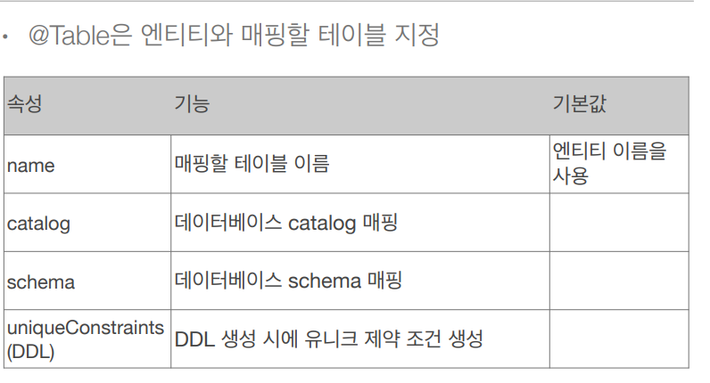

## 객체와 테이블 매핑

* ### @Entity
    * @Entity 가 붙은 클래스는 JPA 가 관리, 엔티티라 한다.
    * JPA 를 사용해서 테이블과 매핑할 클래스는 @Entity 필수
    * 주의
        * 기본 생성자 필수 (파라미터가 없는 public 또는 protected 생성자 / 기본 생성자는 JPA 스펙 상 필요)
        * final 클래스, enum, interface, inner 클래스 사용 X
        * 저장할 필드에 final 사용 X
    

* ### @Entity 속성 정리
    * 속성 : name
        * JPA 에서 사용할 엔티티 이름을 지정한다.
        * 기본값 : 클래스 이름을 그대로 사용(예: Member)
        * 같은 클래스 이름이 없으면 가급적 기본값을 사용한다.
    
* ### @Table
    