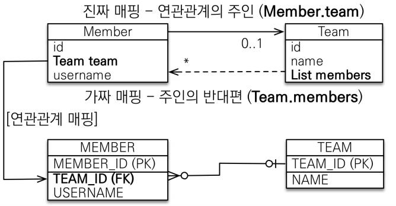
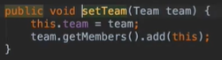

## 연관관계

* ### 연관관계가 필요한 이유
  * ```객제지향 설계의 목표는 자율적인 객체들의 협력 공동체를 만드는 것이다.```
  

* ### 양방향 매핑 규칙
  * 객체의 두 관계중 하나를 연관관계의 주인으로 지정
  * 연관관계의 주인만이 외래 키를 관리(등록, 수정)
  * 주인이 아닌쪽은 읽기만 가능
  * 주인은 mappedBy 속성 사용X
  * 주인이 아니면 mappedBy 속성으로 주인 지정
  

* ### 누구를 주인으로?
  * 외래 키가 있는 곳을 주인으로 정해라
  * 여기서는 Member.team 이 연관 관계의 주인
    
    

* ### 양방향 매핑시 가장 많이 하는 실수
  * 연관관계의 주인에 값을 입력하지 않는 경우
  * 양방향 매핑시 연관관계의 주인에 값을 입력해야 한다!
    * 순수한 객체 관계를 고려하면 항상 양쪽다 값을 입력해야 한다.
      * ```
        member.setTeam(team);
        team.getMembers().add(member);
        ```
      * 연관관계 편의 메소드를 생성하자
        
        
        * setter 메서드에 추가해줘도 되고 따로 메서드를 만들어줘도 된다.
  
  * 양방향 매핑시에 무한 루프를 조심하자 (내가 실제로 겪었던 것...)
    * 예 : toString(), lombok, JSON 생성 라이브러리
    * lombok 에 toString 기능을 쓰지말고 , Controller 단에서 Entity 를 반환 해주지 말 것.


* ### 양방향 매핑 정리
  * 단방향 매핑만으로도 이미 연관관계 매핑은 완료
    * 단방향 매핑만해도 충분히 가능하다.
    * 연관 관계의 주인을 중심으로 단방향 매핑을 해주면 된다.
  * 양방향 매핑은 반대 방향으로 조회(객체 그래프 탐색) 기능이 추가된 것 뿐
  * JPQL 에서 역방향으로 탐색할 일이 많음
  * 설계시 단방향 매핑을 먼저 잘 해두고 양방향은 필요할 때 추가해도 된다. (테이블에 영향을 주지 않음)
  

* ### 연관관계의 주인을 정하는 기준
  * 비즈니스 로직을 기준으로 연관관계의 주인을 선택하면 안됨
  * 연관관계의 주인은 외래 키의 위치를 기준으로 정해야함
  