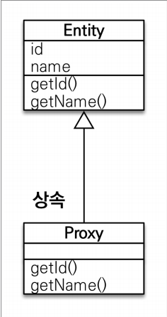
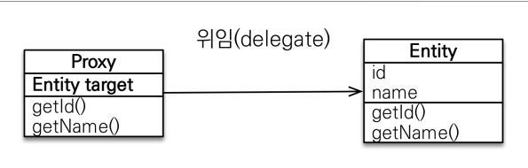
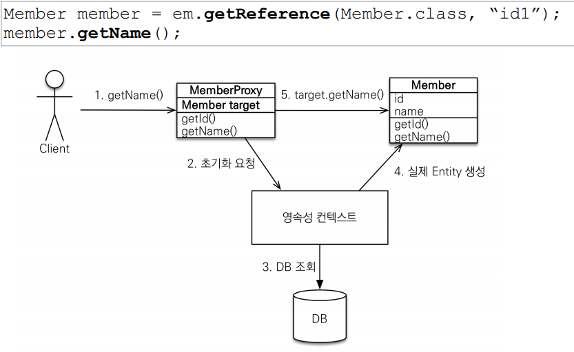

## 프록시

* ### 프록시의 탄생배경
    * Member 를 조회할 때 Team 도 함께 조회해야할까?
        * 회원만 필요한 로직에는 Team 까지 조회하게 되면 효율성이 떨어진다.
    

* ### 프록시 기초
    * em.find() vs em.getReference()
    * em.find() : 데이터베이스를 통해서 실제 엔티티 객체 조회
    * em.getReference() : 데이터베이스 조회를 미루는 가짜(프록시) 엔티티 객체 조회
    

* ### 프록시 구조
    
    * 실제 클래스를 상속 받아서 만들어짐
    * 실제 클래스와 겉 모양이 같다.
    * 사용하는 입장에서는 진짜 객체인지 프록시 객체인지 구분하지 않고
    사용하면 됨(이론상)
    * 프록시 객체는 실제 객체의 참조(target)를 보관
    * 프록시 객체를 호출하면 프록시 객체는 실제 객체의 메소드 호출
    
      

* ### 프록시 객체의 초기화 과정
    
  

* ### 프록시의 특징
    * 프록시 객체는 처음 사용할 때 한 번만 초기화
    * 프록시 객체를 초기화 할 때, 프록시 객체가 실제 엔티티로 바뀌는 것은 아님, 초기화되면 프록시 객체를 통해서 실제 엔티티에 접근 가능
    * 프록시 객체는 원본 엔티티를 상속받음, 따라서 타입 체크시 주의해야함 (== 비교 실패, 대신 instance of 사용)
    * 영속성 컨텍스트에 찾는 엔티티가 이미 있으면 em.getReference()를 호출해도 실제 엔티티 변환
      (예: 먼저 em.find()로 찾은 엔티티 변환)
      
    * 영속성 컨텍스트의 도움을 받을 수 없는 준영속 상태일 때, 프록시를 초기화하면 문제 발생
      (예: em.detach(), em.clear() 등을 하고 프록시 데이터 조회시 에러)
      

* ### 프록시 확인
    * 프록시 인스턴스의 초기화 여부 확인
        * ```PersistenceUnitUtil.isLoaded(Object entity)```
        * ```emf.getPersistenceUnitUtil().isLoaded(entity)``` 엔티티 팩토리 매니저를 이용해 사용    
    * 프록시 클래스 확인 방법
        * ```entity.getClass()``` 출력
    * 프록시 강제 초기화
        * ```Hibernate.initialize(entity);```
    
