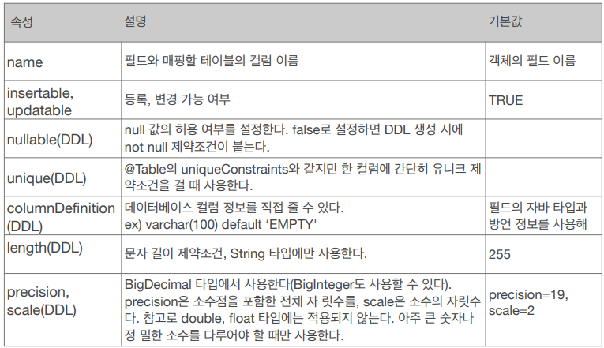

## 필드와 컬럼 매핑

* ### 매핑 어노테이션 정리
    * @Column
        * 컬럼 매핑
            
          
    * @Temporal
        * 날짜 타입을 매핑할 때 사용
        * LocalDate, LocalDateTime 을 사용할 때는 생략 가능 (최신 하이버네이트 지원)
            자바 8 이상은 다 지원 해주기때문에 주로 생략
          
    * @Enumerated
        * 자바 enum 타입을 매핑할 때 사용
        * value 속성
            * ```EnumType.ORDINAL``` : enum 순서를 데이터베이스에 저장 (사용X)
            * ```EnumType.STRING``` : enum 이름을 데이터베이스에 저장
            * 기본 값이 ORDINAL 이기때문에 STRING 으로 바꿔주어야 한다.
    * @Lob
        * 데이터베이스 BLOB, CLOB 타입과 매핑
        * @Lob 에는 지정할 수 있는 속성이 없다.
        * 매핑하는 필드 타입이 문자면 CLOB 매핑, 나머지는 BLOB 매핑
            * CLOB : String, char[], java.sql.CLOB
            * BLOB : byte[], java.sql.BLOB
    * @Transient
        * 필드 매핑X
        * 데이터베이스에 저장X, 조회X
        * 주로 메모리상에서만 임시로 어떤 값을 보관하고 싶을 때 사용
        * ```
          @Transient
          private Integer temp;
          ```