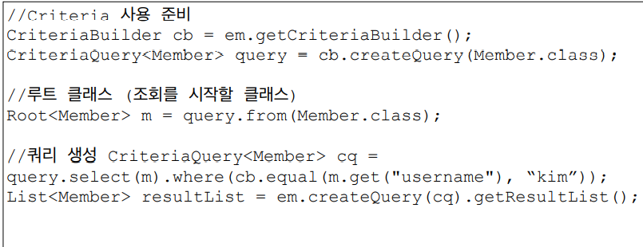
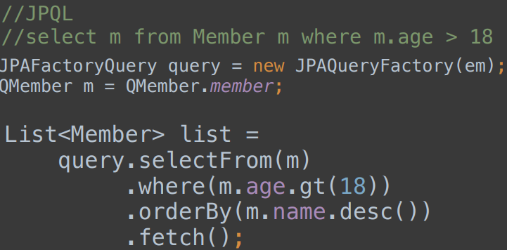
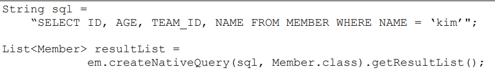

## 객체지향 쿼리 언어 소개

* ### JPA 는 다양한 쿼리 방법을 지원
    * ```JPQL```
    * JPA Criteria
    * ```QueryDSL```
    * 네이티브 SQL
    * JDBC API 직접 사용, MyBatis, SpringJdbcTemplate 함께 사용
    

* ### JPQL 소개
    * 가장 당순한 조회 방법
        * ```EntityManager.find()```
        * 객체 그래프 탐색(a.getB().getC())
    * JPA 는 SQL 을 추상화한 JPQL 이라는 객체 지향 쿼리 언어 제공
    * SQL 과 문법 유사 SELECT, FROM, WHERE, GROUP BY, HAVING, JOIN 지원
    * JPQL 은 엔티티 객체를 대상을 쿼리
    * SQL 은 데이터베이스 테이블을 대상으로 쿼리

* ### JPQL 탄생배경
    * JPA 를 사용하면 엔티티 객체 중심으로 개발
    * 문제는 검색 쿼리
        * 나이가 18살 이상인 회원을 모두 검색하고 싶다면?
    * 검색 할 때도 테이블이 아닌 엔티티 객체를 대상으로 검색
    * 모든 DB 데이터를 객체로 변환해서 검색하는 것은 불가능
    * 애플리케이션이 필요한 데이터만 DB 에서 불러오려면 결국 검색 조건이 포함된 SQL 이 필요
    

* ### JPQL 예시
    * ``` 
      //검색
      String jpql = "select m From Member m where m.name like ‘%hello%'";
        
      List<Member> result = em.createQuery(jpql, Member.class)
                            .getResultList();
      ```
      
* ### JPQL 정리
    * 테이블이 아닌 객체를 대상으로 검색하는 객체 지향 쿼리
    * SQL 을 추상화해서 특정 데이터베이스 SQL 에 의존 X
    * JPQL 을 한마디로 정의하면 객체 지향 SQL
  

* ### Criteria
  
  * 문자가 아닌 자바코드로 JPQL 을 작성할 수 있음.
  * JPQL 빌더 역할
  * JPA 공식 기능
  * 단점
    * 너무 복잡하고 실용성이 없다.
  * Criteria 대신에 QueryDSL 사용 권장
  

* ### QueryDSL
  
  * 문자가 아닌 자바코르도 JPQL 을 작성할 수 있음.
  * JPQL 빌더 역할
  * 컴파일 시점에 문법 오류를 찾을 수 있음
  * 동적쿼리 작성 편리함
  * 단산하고 쉬움
  * ```실무 사용 권장```
  

* ### 네이티브 SQL
  
  * JPA 가 제공하는 SQL 을 직접 사용하는 기능
  * JPQL 로 해결할 수 없는 특정 데이터베이스에 의존적인 기능
  * 예) 오라클 CONNECT BY, 특정 DB 만 사용하는 SQL 힌트
  

* ### JDBC 직접 사용, SpringJdbcTemplate 등
  * JPA 를 사용하면서 JDBC 커넥션을 직접 사용하거나, 스프링 JdbcTemplate, 마이바티스 등을 함께 사용 가능
  * 단 영속성 컨텍스트를 적절한 시점에 강제로 플러시 사용
    (트랜잭션 안에서 DB 와 같은 데이터를 바라보게 해주어야 하기 때문)
    * 예) JPA 를 우회해서 SQL 을 실행하기 직전에 영속성 컨텍스트 수동 플러스 \
  

* ### 페이징 API
  * JPA 는 페이징을 다음 두 API 로 추상화
    * setFirstResult(int startPosition) : 조회 시작 위치(0 부터 시작)
    * setMaxResults(int maxResult) : 조회할 데이터 수
      ```
      //페이징 쿼리
      String jpql = "select m from Member m order by m.name desc";
      List<Member> resultList = em.createQuery(jpql, Member.class)
                  .setFirstResult(10)
                  .setMaxResults(20)
                  .getResultList();
      ```
      
  * 데이터베이스의 방언에 따라 SQL 문이 작성된다.
  

* ### 조인
  * 내부 조인 : ```SELECT m FROM Member m [INNER] JOIN m.team t```
  * 외부 조인 : ```SELECT m FROM Member m LEFT [OUTER] JOIN m.team t```
  * 세타 조인 : ```SELECT count(m) FROM Member m, Team t WHERE m.username = t.name```
  * ON 절
    * ON 절을 활용한 조인(JPA 2.1부터 지원)
      1. 조인 대상 필터링
        * 예) 회원과 팀을 조인하면서, 팀 이름이 A인 팀만 조인
          ```
          JPQL:
          SELECT m, t FROM Member m LEFT JOIN m.team t on t.name = 'A'
          
          SQL:
          SELECT m.*, t.* FROM
          Member m LEFT JOIN Team t ON m.TEAM_ID=t.id and t.name='A'
          ``` 
      2. 연관관계 없는 엔티티 외부 조인(하이버네이트 5.1부터)
    