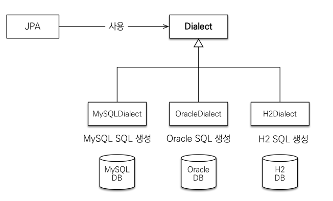
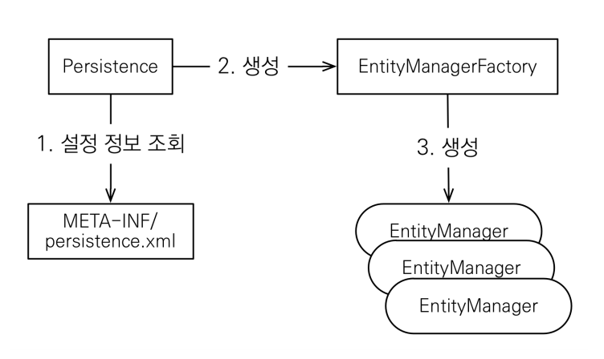
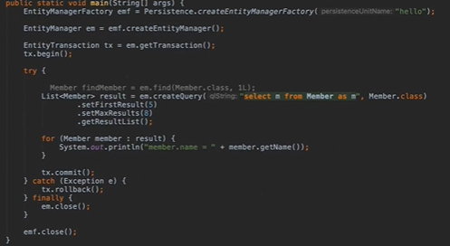

## Hello JPA

* ### 데이터베이스 방언
    * JPA 는 특정 데이터베이스에 종속 X
    * 각각의 데이터베이스가 제공하는 SQL 문법과 함수는 조금씩 다름
        * 가변 문자 : MySQL 은 VARCHAR, Oracle 은 VARCHAR2
        * 문자열을 자르는 함수 : SQL 표준은 SUBSTRING(), Oracle 은 SUBSTR()
        * 페이징 : MySQL 은 LIMIT, Oracle 은 ROWNUM
    * 방언 : SQL 표준을 지키지 않는 특정 데이터베이스만의 고유한 기능
    * JPA 는 설정만 해주면 자신이 데이터베이스에 맞게 번역해준다.
        * hibernate.dialect 속성에 지정
            * H2 : org.hibernate.dialect.H2Dialect
            * Oracle 10g : org.hibernate.dialect.Oracle10gDialect
            * MySQL : org.hibernate.dialect.MySQL5InnoDBDialect
        * 하이버네이트는 40가지 이상의 데이터베이스 방언 지원
          
        
      

* ### JPA 구동 방식
    
    
    * #### 코드
        
    * #### 주의
        * 엔티티 매니저 팩토리는 하나만 생성해서 애플리케이션 전체에서 공유
        * 엔티티 매니저는 쓰레드간에 공유X (사용하고 버려야한다.)
        * JPA 의 모든 데이터 변경은 트랜잭션 안에서 실행
        

* ### JPQL 소개
    * #### JPQL 등장배경
        * JPA 를 사용하면 엔티티 객체를 중심으로 개발
        * 문제는 검색 쿼리
        * 검색을 할 때도 테이블이 아닌 엔티티 객체를 대상으로 검색
        * 모든 DB 데이터를 객체로 변환해서 검색하는 것은 불가능
        * 애플리케이션이 필요한 데이터만 DB 에서 불러오려면 결국 검색 조건이 포함된 SQL 이 필요
    
    * #### JPQL 이란?
        * JPA 는 SQL 을 추상화한 JPQL 이라는 객체 지향 쿼리 언어 제공
        * SQL 과 문법 유사, SELECT, FROM, WHERE, GROUP BY, HAVING, JOIN 지원
        * JPQL 은 엔티티 객체를 대상으로 쿼리 , SQL 은 데이터베이스 테이블을 대상으로 쿼리
        * 테이블이 아닌 객체를 대상으로 검색하는 객체 지향 쿼리
        * SQL 을 추상화해서 특정 데이터베이스 SQL 에 의존 X
        * JPQL 을 한 마디로 정의하면 객체 지향 SQL