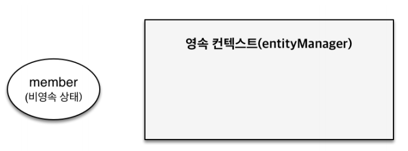

## 영속성 컨텍스트

* ### JPA 에서 가장 중요한 2가지
    * 객체와 관계형 데이터베이스 매핑하기(Object Relational Mapping)
    * 영속성 컨텍스트
    

* ### 엔티티 매니저 팩토리와 엔티티 매니저
    
  

* ### 영속성 컨텍스트
    * JPA 를 이해하는데 가장 중요한 용어
    * ``` 엔티티를 영구 저장하는 환경``` 이라는 뜻
    * ``` EntityManager.persist(entity);```
    * 영속성 컨텍스트는 논리적인 개념으로 눈에 보이지 않는다.
    * 엔티티 매니저를 통해서 영속성 컨텍스트에 접근
    

* ### 엔티티의 생명주기
    * 비영속 (new/transient)
        
        - 영속성 컨텍스트와 전혀 관계가 없는 새로운 상태
        - 객체를 생성한 상태
        - ```
            Member member = new Member();
            member.setId("member1");
            member.setUsername("회원1");
            ```
    * 영속 (managed)
        
        - 영속성 컨텍스트에 관리되는 상태
        - ```
          //객체를 생성한 상태(비영속) 
          Member member = new Member();
          member.setId("member1");
          member.setUsername(“회원1”);
           
          EntityManager em = emf.createEntityManager();
          em.getTransaction().begin();
          
          //객체를 저장한 상태(영속)
          em.persist(member);
          ```
          
    * 준영속, 삭제
        - ```
            //회원 엔티티를 영속성 컨텍스트에서 분리, 준영속 상태 
            em.detach(member); 
          ```
          
        - ```
            //객체를 삭제한 상태(삭제) 
            em.remove(member);
          ```