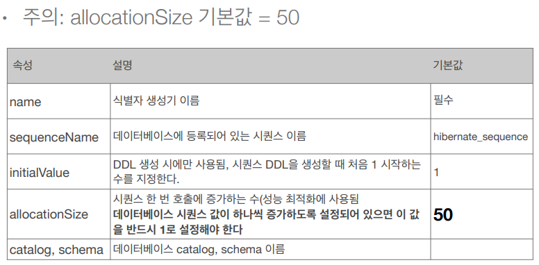

## 기본 키 매핑

* ### 기본 키 매핑 어노테이션
    * @Id
    * @GeneratedValue
    
* ### 기본 키 매핑 방법
    * 직접 할당 : @Id 만 사용
    * 자동 생성(@GeneratedValue)
        * IDENTITY : 데이터베이스에 위임, MYSQL
        * SEQUENCE : 데이터베이스 시퀀스 오브젝트 사용, ORACLE
            * @SequenceGenerator 필요
        * TABLE : 키 생성용 테이블 사용, 모든 DB 에서 사용
            * @TableGenerator 필요
        * AUTO : 방언에 따라 자동 지정, 기본 값
    
* ### IDENTITY 전략 - 특징
    * 기본 키 생성을 데이터베이스에 위임
    * 주로 MySQL, PostgreSQL, SQL Server, DB2 에서 사용 (예 : MySQL 의 AUTO_INCREMENT)
    * JPA 는 보통 트랜잭션 커밋 시점에 INSERT SQL 실행
    * AUTO_INCREMENT 는 데이터베이스에 INSERT SQL 을 실행한 이후에 ID 값을 알 수 있음
    * IDENTITY 전략은 em.persist() 시점에 즉시 INSERT SQL 실행하고 DB 에서 식별자를 조회
    * ```
      @Id 
      @GeneratedValue(strategy = GenerationType.IDENTITY)
      private Long id;
      ```
      

* ### SEQUENCE 전략 - 특징
    * 데이터베이스 시퀀스는 유일한 값을 순서대로 생성하는 특별한 데이터베이스 오브젝트(예: 오라클 시퀀스)
    * 오라클, PostgreSQL, DB2, H2  데이터베이스에서 사용
    * ```
      @Entity 
      @SequenceGenerator(
            name = “MEMBER_SEQ_GENERATOR",
            sequenceName = “MEMBER_SEQ", //매핑할 데이터베이스 시퀀스 이름
            initialValue = 1, allocationSize = 1)
      public class Member {

            @Id
            @GeneratedValue(strategy = GenerationType.SEQUENCE,
                    generator = "MEMBER_SEQ_GENERATOR")
            private Long id;

      ```
      
* ### SEQUENCE - @SequenceGenerator
     
  

* ### TABLE 전략
    * 키 생성 전용 테이블을 하나 만들어서 데이터베이스 시퀀스를 흉내내는 전략
    * 장점 : 모든 데이터베이스에 적용 가능
    * 단점 : 성능
    * 현업에서도 잘 사용하지 않음 (비추)
    

* ### TABLE 전략 - 매핑
    * ```
      @Entity 
      @TableGenerator(
                name = "MEMBER_SEQ_GENERATOR",
                table = "MY_SEQUENCES",
                pkColumnValue = “MEMBER_SEQ", allocationSize = 1)
      public class Member {
        @Id
        @GeneratedValue(strategy = GenerationType.TABLE,
                        generator = "MEMBER_SEQ_GENERATOR")
        private Long id;
      ```
      
    * TableGenerator 도 SEQUENCE 전략과 같이 allocationSize 속성이 있다.
    

* ### 권장하는 식별자 전략
    * 기본 키 제약 조건 : null 아님, 유일, 변하면 안된다.
    * 미래까지 이 조건을 만족하는 자연키는 찾기 어렵다. 대리키(대체키)를 사용하자.
    * 예를 들어 주민등록번호도 기본 키로 적절하지 않다.
    * 권장 : Long 형 + 대체키 + 키 생성 전략 사용
    * int 형과 Long 형의 성능 차이는 없으나 키 값의 범위 차이가 있기때문에 미래를 위해 Long 을 사용하자.