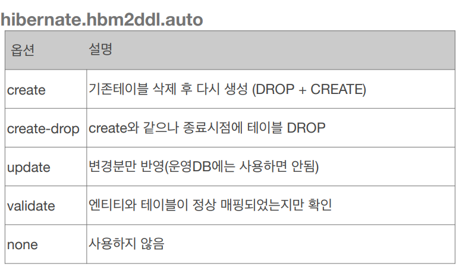

## 데이터베이스 스키마 자동 생성

* ### 데이터베이스 스키마 자동 생성
    * DDL 을 애플리케이션 실행 지점에 자동 생성
    * 테이블 중심 -> 객체 중심
    * 데이터베이스 방언을 활용해서 데이터베이스에 맞는 적절한 DDL 생성
    * 이렇게 생성된 DDL 은 개발 장비에서만 사용
    * 생성된 DDL 은 운영서버에서는 사용하지 않거나, 적절히 다듬은 후 사용
    
* ### 데이터베이스 스키마 자동 생성 - 속성
    
  

* ### 데이터베이스 스키마 자동 생성 - 주의
    * ``` 운영 장비에는 절대 create, create-drop, update 사용하면 안된다.```
    * 개발 초기 단계는 create 또는 update
    * 테스트 서버는 update 또는 validate
    * 스테이징과 운영 서버는 validate 또는 none
    
* ### DDL 생성 기능
    * 제약조건 추가 : 회원 이름은 필수, 10자 초과 X
        * ```@Column(nullable = false, length = 10)```
    * 유니크 제약조건 추가
        * ```@Table(uniqueConstraints = {@UniqueConstraint( name = "NAME_AGE_UNIQUE",columnNames = {"NAME", "AGE"} )}) ```
    * DDL 생성 기능은 DDL 을 자동 생성할 때만 사용되고 JPA 의 실행 로직에는 영향을 주지 않는다.