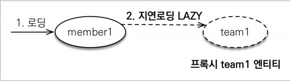
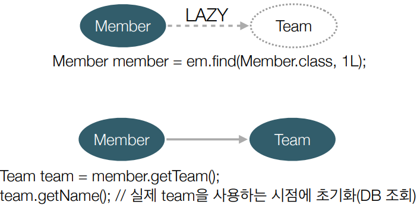
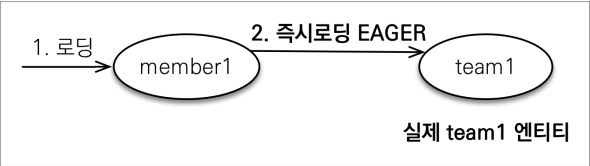
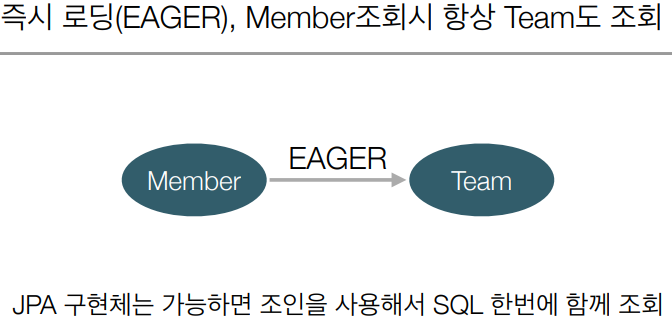

## 즉시 로딩과 지연 로딩

* ### 지연 로딩 LAZY 사용배경
    * Member 를 조회할 때 Team 도 함께 조회해야 할까?
        * 단순히 member 정보만 사용하는 비즈니스 로직이면 지연 로딩 LAZY 를 사용해서 프록시로 조회
    

* ### 지연 로딩
    
    
  

* ### 즉시 로딩
    
    
  

* ### 프록시와 즉시 로딩 주의
    * 가급적 지연 로딩만 사용(```특히 실무에서```)
    * 즉시 로딩을 적용하면 예상하지 못한 SQL 이 발생
    * 즉시 로딩은 JPQL 에서 N+1 문제를 일으킨다.
    * @ManyToOne, @OneToMany 는 기본이 즉시 로딩 -> LAZY 로 바꿔줘야한다.
    * @OneToMany, @ManyToMany 는 기본이 지연 로딩
    

* ### 지연 로딩 활용 - 실무
    * 모든 연관관계에 지연 로딩을 사용해라!
    * 실무에서 즉시 로딩 사용하지 마라!
    * JPQL fetch 조인이나, 엔티티 그래프 기능을 사용해라!
        * 즉시 로딩이 필요한 로직이면 지연 로딩으로 설정 후 사용
    * 즉시 로딩은 상상하지 못한 쿼리가 나갈 수 있다.